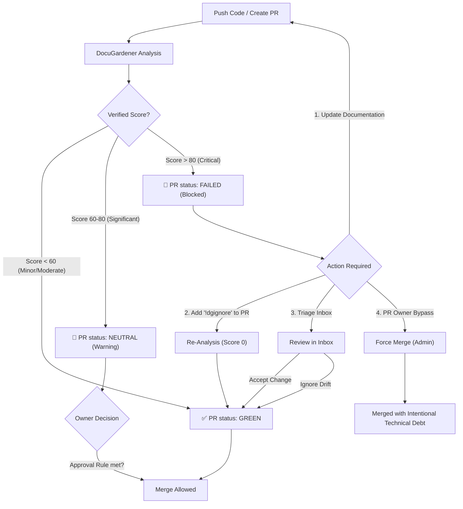

# DocuGardener

> When your agents write the code, DocuGardener writes the docs. You just approve.

[](https://www.python.org/downloads/)
[](https://www.gnu.org/licenses/agpl-3.0)

## Overview

DocuGardener is the documentation safety net for AI-native engineering teams. As Copilot, Cursor, and Devin write more of your code, DocuGardener detects documentation drift in every PR and — for AI-authored code — drafts and merges the fix automatically. No human touchpoint required.

### For Platform Engineers — Zero-touch docs for AI-authored code

- 🤖 **AI Author Mode (Zero-Touch)**: Detects AI-authored PRs (Copilot, Cursor, Devin, Claude) and automatically drafts + merges documentation updates. Supports all three GitHub merge methods (squash / merge commit / rebase). The fix PR body shows exactly which AI authorship signal triggered it.
- 🚀 **CI-native drift detection**: Analyzes every PR diff; blocks merges when docs fall behind code. First scan in under 3 minutes with the bundled zero-config LLM key.
- 📥 **Triage Inbox**: Centralized dashboard to review, accept, or ignore drift alerts across all repos. High-contrast semantic diffs, keyboard-driven (`j`/`k`, `a`, `i`).
- 🤖 **Auto-Fix PR (`autoHeal`)**: Drafts the precise Markdown update and opens a PR. The developer just reviews and merges.
- 🔗 **Cross-Repo Drift Detection** *(beta)*: Detects when a change in one repository has documentation implications in sibling repositories. Configurable per-repo in Settings (Team plan+).
- 🔌 **VS Code Extension (Pre-push Check)**: Real-time drift diagnostics in the IDE via a stateless `/check` API — catch issues before code reaches CI.
- 📊 **Nightly Rollup Reports**: Automated scheduler (02:00 UTC) creates GitHub Issues per repository summarizing average drift, peak scores, and high-drift PRs.
- 🔌 **Slack & Jira Integrations**: Push drift alerts to Slack channels; auto-comment on existing Jira tickets at four lifecycle points (drift detected → fix PR created → no update required → fix PR merged). Pro+.
- 🎮 **Git Diff Simulator & Prompt Playground**: Paste raw diffs to preview scoring; override system prompts per tenant to tune verification strictness. Pro+.

### For Compliance & Governance Teams — Produce evidence, prove controls

- 🔒 **Zero-Retention Architecture**: Source code is cloned into a RAM-disk (tmpfs), analyzed, and wiped instantly. Never stored.
- 🏢 **Strict Multi-Tenancy**: Namespace isolation at the vector DB level via FastAPI context middleware. Physically impossible for one tenant to query another's data.
- 📋 **Audit Log (SHA-256 Hash Chain)**: Every verification job, triage decision, and dismiss action is cryptographically logged. Tamper-evident by design.
- 👥 **Role-Based Access Control (4 roles)**: ADMIN, AUDITOR, BILLING_ADMIN, VIEWER — enforced at every API endpoint. AUDITOR and BILLING_ADMIN available on Pro+.
- ✍️ **Required Dismiss Reason**: Dismissing critical or significant drift requires a typed justification. Creates an attributed evidence trail in the audit log.
- 📉 **Ignore-rate Analytics**: Deep-dive reporting on bypass patterns, severity breakdowns, and triage trends. Makes bypass behavior visible before it becomes a compliance gap. Pro+.
- 📊 **Governance Proof Points**: Reports dashboard surfaces % PRs with drift, average time to triage, and % critical alerts dismissed — ready for board-level conversations.
- 📤 **Evidence Export (CSV / JSON)**: One-click export of the audit log filtered by date range and event type. Team plan only.
- 🔐 **SSO / SAML 2.0 + SCIM**: Identity federation and automated user provisioning for enterprise identity providers (Okta, Entra ID, Google Workspace). Team plan only.
- 💳 **Billing & Usage Monitoring**: Real-time LLM token tracking per job, daily cost chart, provider/model breakdown, configurable monthly budget with hard-block enforcement.
- 🛡️ **Prompt Guardrails**: Domain-anchored prompts, content length caps, forbidden pattern blocklist, and audit logging protect against prompt injection. ADMIN-only access.

## Deployment

| Method | When to use |
|---|---|
| **Docker Compose** | Local dev, single-server |
| **Kubernetes / Helm** | On-premise regulated environments (TEAM plan), HA production |

For Kubernetes, the Helm chart is published to GHCR and verified:

```bash
helm pull oci://ghcr.io/docugardener/helm/docugardener --version 0.2.0
helm install docugardener oci://ghcr.io/docugardener/helm/docugardener \
  --version 0.2.0 --namespace docugardener --create-namespace \
  -f your-values.yaml
```

The chart ships with PSA `restricted`-compatible pod specs, NetworkPolicies, air-gap mode, and KEDA `ScaledObject` support (disabled by default). Releases are cosign-signed via GitHub Actions OIDC. See [helm/docugardener/CHANGELOG.md](helm/docugardener/CHANGELOG.md) and the [Kubernetes docs](https://docugardener.dev/docs/self-hosting/kubernetes) for the full values reference.

---

## Quick Start

### Prerequisites

- Python 3.12+
- Docker & Docker Compose (Compose V2)
- GitHub App credentials

### Installation

```bash
# Clone repository
git clone https://github.com/docugardener/docugardener.git
cd docugardener

# Create virtual environment
python -m venv .venv
source .venv/bin/activate  # or `.venv\Scripts\activate` on Windows

# Install dependencies
pip install -e ".[dev]"

# Copy environment templates — both files are required
cp .env.example .env
cp web/.env.example web/.env

# Generate a shared encryption key and set it in BOTH files
# (credentials saved via the UI are encrypted with this key; the backend
# decrypts them at job runtime — they must be identical or every job fails)
ENCRYPTION_KEY=$(openssl rand -hex 32)
sed -i '' "s|ENCRYPTION_KEY=.*|ENCRYPTION_KEY=${ENCRYPTION_KEY}|" .env
sed -i '' "s|ENCRYPTION_KEY=.*|ENCRYPTION_KEY=${ENCRYPTION_KEY}|" web/.env

# Edit both files to fill in the remaining values.
# NOTE: DEPLOYMENT_MODE=saas is correct for all self-hosted installs.
#       Only use air-gap for fully offline enterprise environments.
#       Do not copy this value from another instance — always use the .env.example default.
# NOTE: GitHub App params (GITHUB_APP_ID, GITHUB_WEBHOOK_SECRET, GITHUB_PRIVATE_KEY_PATH)
#       go in root .env only — the web frontend reads them via the backend API.
#       Do NOT add them to web/.env.
```

### Running Locally

```bash
# Install Next.js dependencies (required once after clone)
cd web && npm install && cd ..

# Start all services: postgres, pgbouncer, redis, weaviate, worker, smee + FastAPI
# Also runs Prisma migrations automatically on first start
make dev-up
# Re-installing on the same machine? Remove stale containers first if you see name conflicts:
# docker rm -f docugardener docugardener-worker docugardener-smee docugardener-weaviate docugardener-postgres docugardener-redis

# Check everything is healthy
make dev-check

# Start the Next.js dev server (separate terminal) — uses PORT from web/.env
make web-dev
```

### Running Tests

**1,700+ Python unit + integration tests** + **1,400+ Vitest component tests** + **Playwright E2E** — all passing.

```bash
# Unit + integration tests
.venv/bin/pytest tests/unit/ tests/integration/ -q

# E2E tests (requires running stack)
E2E_ENABLED=1 pytest tests/e2e/ -m e2e -v

# Frontend (Vitest)
cd web && npx vitest run

# TypeScript check
cd web && npx tsc --noEmit
```

## Architecture

```text
┌─────────────────────────────────────────────────────────────────┐
│                         GitHub                                   │
│  ┌──────────┐    ┌──────────────┐    ┌─────────────────────┐   │
│  │    PR    │───▶│   Webhook    │───▶│  Check Run / Comment│   │
│  └──────────┘    └──────────────┘    └─────────────────────┘   │
└─────────────────────────────────────────────────────────────────┘
                           │
                           ▼
┌─────────────────────────────────────────────────────────────────┐
│                     DocuGardener                                 │
│  ┌──────────────┐  ┌──────────────┐  ┌──────────────────────┐  │
│  │   Ephemeral  │  │   Semantic   │  │   RAG Verification   │  │
│  │   Ingestion  │─▶│   Analysis   │─▶│   (2-Stage LLM)      │  │
│  │   (tmpfs)    │  │ (tree-sitter)│  │                      │  │
│  └──────────────┘  └──────────────┘  └──────────────────────┘  │
│         │               ▲                       │               │
│         ▼               │                       ▼               │
│  ┌──────────────┐  ┌──────────────┐      ┌──────────────────────┐  │
│  │    Local     │  │   IDE /check │      │ Gemini/OpenAI/       │  │
│  │  Embeddings  │  │   (Stateless)│      │ Anthropic/Ollama     │  │
│  └──────────────┘  └──────────────┘      └──────────────────────┘  │
└─────────────────────────────────────────────────────────────────┘
                           │
                           ▼
┌─────────────────────────────────────────────────────────────────┐
│                     Vector DB (Weaviate)                         │
│   Strict Multi-tenant isolation via Context-Aware Client         │
└─────────────────────────────────────────────────────────────────┘
```

## 🚥 Governance Logic

DocuGardener acts as a gatekeeper but respects repository ownership. The governance flow is designed to balance strict documentation quality with development velocity.

### Workflow Diagram



### User Actions & Overrides

When DocuGardener blocks a Pull Request (Critical Drift), users have 3 options:

1. **✅ Fix (The Golden Path)**
    - **Action**: Update the documentation in the code and push a new commit.
    - **Outcome**: DocuGardener re-scans, finds no drift (Score ~0), and marks the check as **Success**.

2. **🙈 Ignore (Explicit Bypass)**
    - **Action**: Add `!dgignore` to the PR description or comment.
    - **Outcome**: The bot acknowledges the tag and forces a **Success** status with a "Skipped" note. Useful for internal-only changes or rapid prototypes.

3. **📥 Triage (The Professional Path)**
    - **Action**: Visit the **Inbox** in the Dashboard.
    - **Outcome**: Review the semantic diff, provide a mandatory **Ignore Reason** for significant drift, then click **Accept Changes** (to ACK the drift) or **Ignore** (to skip for now). The PR status is automatically updated to **Success**.

4. **🚨 Force Merge (Admin Override)**
    - **Action**: Repository Admins can bypass the "Required Status Check" in GitHub UI.
    - **Outcome**: The PR is merged despite the red status. This registers as "Intentional Technical Debt" in the audit trail and is visible in **Ignore Analytics**.

## 💡 LLM Model & Pricing

DocuGardener has three ways to run the AI analysis engine. Understanding this upfront prevents surprises:

| Mode | Who pays for LLM? | Cost to you | Notes |
|---|---|---|---|
| **Platform LLM (default)** | DocuGardener | Free up to limits | Uses a bundled Gemini Flash key. Shared €10/month operator budget (~8,000 PR analyses). Once the monthly budget is reached, analyses prompt users to configure their own API key. Self-hosters control this via `PLATFORM_LLM_MONTHLY_CAP_EUR`. |
| **BYOK — Cloud API** | You (your API key) | $0 to DocuGardener | Bring your own Gemini / OpenAI / Anthropic key in Settings. No platform cost cap, but your key is billed by the provider. |
| **BYOK — Local (Ollama)** | You (CPU/GPU) | $0 to anyone | Run any Ollama model locally. Set `LLM_PROVIDER=ollama` and `OLLAMA_URL` in your `.env`. |

### What changes with BYOK?

Core features work with all three modes — PR drift detection, GitHub check runs, inbox triage, auto-fix PRs, VS Code extension.

The following **additional DocuGardener services** require the platform LLM (they run server-side on our infrastructure and consume our API credits):

- **Hosted Nightly Rollup** — automated daily GitHub issue with drift summary (self-hosted instances can run their own scheduler)
- **Platform Analytics** — aggregate drift trends across your org (future)

BYOK users who self-host get full control of all features without restriction. The distinction only applies to the managed cloud offering.

### Setting up BYOK

In **Settings → Intelligence tab**:

1. Select your provider (Gemini, OpenAI, Anthropic, or Ollama)
2. Enter your API key (stored encrypted with AES-256-GCM, never logged)
3. Optionally run **Test Connection** to validate before saving

For local Ollama, set in your server `.env`:
```bash
LLM_PROVIDER=ollama
OLLAMA_URL=http://localhost:11434
OLLAMA_MODEL=llama3.2
```

## 📦 Plans

| | Free | Pro | Team |
|---|:---:|:---:|:---:|
| Repositories | 1 public | 5 | Unlimited |
| PR analyses / month ¹ | 50 | 500 | Unlimited |
| Seat count | 1 | 10 | 100 |
| Private repos | — | ✅ | ✅ |
| 14-day PRO trial | ✅ (once) | — | — |
| Slack, Jira & Linear integrations | — | ✅ | ✅ |
| Ignore-rate analytics | — | ✅ | ✅ |
| Prompt engineering playground | — | ✅ (+ trial) | ✅ |
| Nightly rollup digest | — | ✅ | ✅ |
| Audit log | — | ✅ | ✅ |
| Evidence export (CSV/JSON) | — | — | ✅ |
| AUDITOR / BILLING_ADMIN roles | — | ✅ | ✅ |
| Holistic scoring model | — | ✅ | ✅ |
| BYOK (cloud or local) | ✅ | ✅ | ✅ |
| SSO / SAML 2.0 | — | — | ✅ |
| SCIM 2.0 user provisioning | — | — | ✅ |
| Cross-repo drift detection *(beta)* | — | — | ✅ |
| Compliance templates | — | — | ✅ |
| Session idle timeout | — | — | ✅ |
| On-premise Helm chart (K8s) | — | — | ✅ |
| Priority support | — | — | ✅ |

> ¹ Platform LLM analyses using the bundled key. BYOK tenants are limited only by their own API quota and the optional per-tenant budget in Settings.

> **Self-hosted operators:** Plan limits are configurable defaults, not hard walls.
> Change a tenant's plan in **Settings → Billing** (owner console) or directly:
> ```sql
> UPDATE "Tenant" SET plan = 'TEAM' WHERE id = '<tenant-id>';
> ```
> The limits exist to help you manage your own LLM costs — not DocuGardener-imposed paywalls.

## 👥 Team Management & Multi-Tenancy

DocuGardener uses a **Tenant-based** architecture to support teams and organizations.

### Core Concepts

- **Tenant**: A secure workspace that holds your configuration, repositories, and job history. All data is isolated to the tenant.
- **User Association**: Users are linked to a single Tenant via their email address.

### Invitation Flow

1. **Admin Invite**: An existing Admin goes to the Dashboard and enters a colleague's email (e.g., `alice@example.com`).
2. **Pre-Provisioning**: The system creates a user record linked to your Tenant.
3. **Seamless Onboarding**: When `alice@example.com` logs in via GitHub (or other providers), she is automatically matched to your workspace.

### Strict Isolation Layer

- **`TenantContextMiddleware`**: Every API request is intercepted to establish a secure tenant context using `contextvars`.
- **Isolated Storage**: The Weaviate client is refactored to be context-aware, automatically scoping all searches and upserts to the current tenant's namespace.
- **Worker Safety**: Background jobs inherit and enforce the tenant context from the moment they are dequeued.

### Roles

| Role | Plan | Permissions |
| :--- | :--- | :--- |
| **ADMIN** | All | Full access — manages LLM keys, prompts, team members, billing, and all settings. |
| **AUDITOR** | Pro+ | Read-only access to the audit log, jobs, and reports. Cannot mutate data. |
| **BILLING_ADMIN** | Pro+ | Manages billing settings and views usage dashboards. No access to code-related features. |
| **VIEWER** | All | Read-only access to dashboards, inbox, and drift reports. Displayed as "Developer" in the UI. |

> AUDITOR and BILLING_ADMIN roles are available on Pro and Team plans only.

## 🧠 Intelligence & Customization

DocuGardener adapts to your team's workflow and culture.

### 🎭 Tone Settings

Configure the personality of the AI verification agent:

- **Strict (Default)**: Best for high-compliance environments. Concise and factual.
- **Detailed**: Best for junior teams. Explains the "why" behind the code/doc mismatch.
- **Friendly**: Best for culture building. Uses encouraging language and emojis.

### 🙈 Ignore Patterns

Sometimes documentation isn't needed (e.g., legacy code, generated files).

- Add custom glob patterns (like `.gitignore`) in the Settings UI.
- Use the **Real-time Tester** to verify if a file matches your rules before saving.

### 🎮 Drift Simulator & Prompt Playground

DocuGardener provides a full suite of tools for "Red Teaming" your documentation:

- **Prompt Engineering Playground**: Override system prompts (e.g., `GENERATOR_SYSTEM_PROMPT`) per tenant to change the AI's "voice" or verification strictness.
- **Git Diff Simulator**: Paste raw Git Diffs to see how the bot would score them against your current rules and prompts.
- **Real-time Feedback**: Visualize the **Drift Score** and reasoning breakdown instantly.

## Configuration

See [.env.example](.env.example) for all configuration options.

Key settings (root `.env` — Python backend):

- `GITHUB_APP_ID`: Your GitHub App ID
- `GITHUB_PRIVATE_KEY_PATH`: Path to GitHub App private key
- `VECTOR_DB_PROVIDER`: `weaviate` (recommended) or `pinecone`
- `LLM_PROVIDER`: `gemini`, `openai`, `anthropic`, or `ollama`
- `GEMINI_API_KEY`: Google Gemini API key (BYOK)
- `OPENAI_API_KEY`: OpenAI API key (BYOK)
- `ANTHROPIC_API_KEY`: Anthropic API key (BYOK)
- `BUNDLED_GEMINI_KEY`: Operator-level fallback key for zero-config first run (optional)
- `BUNDLED_GEMINI_MODEL`: Model used with the bundled key (default: `gemini-2.0-flash`)

Key settings (`web/.env` — Next.js frontend):

- `DATABASE_URL`: PostgreSQL connection string
- `NEXTAUTH_SECRET`: Random secret for session signing
- `ENCRYPTION_KEY`: Must be identical to root `.env` — used to call the backend credential API
- `GITHUB_ID` / `GITHUB_SECRET`: GitHub OAuth App credentials (distinct from the GitHub App)
- `BUNDLED_GEMINI_KEY`: Must match the root `.env` value — controls "Platform Default" card visibility in Settings
- GitHub App params (`GITHUB_APP_ID`, `GITHUB_WEBHOOK_SECRET`, `GITHUB_PRIVATE_KEY_PATH`) are **backend-only** — set them in root `.env` only. The web frontend reads them via the backend API.

## Contributing

We welcome contributions. See [CONTRIBUTING.md](CONTRIBUTING.md) for setup, test commands, and code conventions.

Frontend contributors: see [Design System](docs/design-system.md) for UI primitives and token rules.

## License

DocuGardener is open source under the [GNU Affero General Public License v3.0 (AGPL-3.0)](LICENSE).

You are free to self-host, modify, and distribute the software. If you run a modified version as a network service, you must make the source available under the same license.

A managed SaaS offering is available at [docugardener.dev](https://docugardener.dev) — same code, zero ops.
