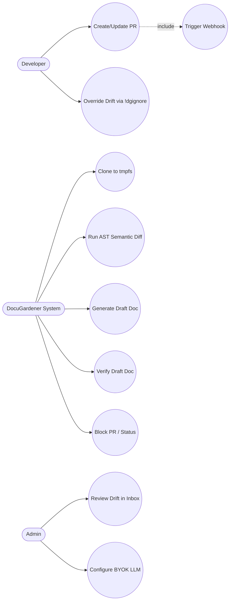
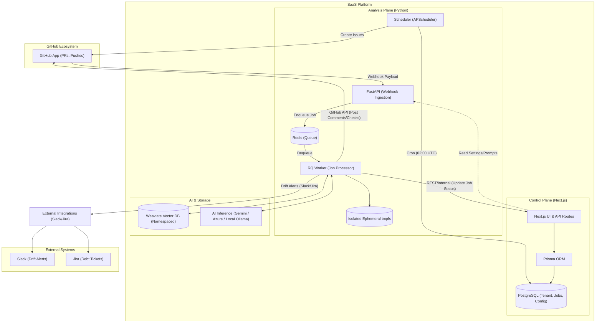
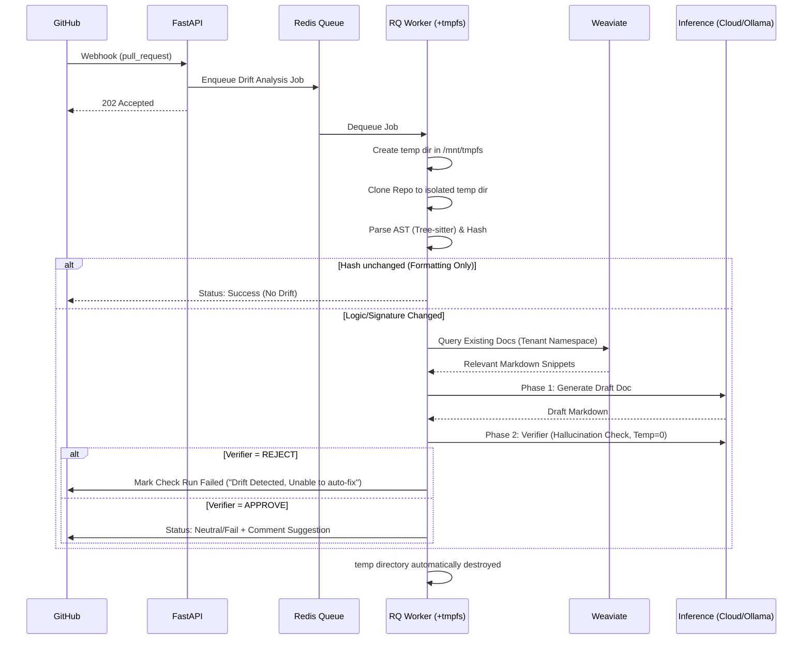

# DocuGardener: Software Architecture Specification

## 1. Capabilities & Core Architectural Pattern

DocuGardener acts as the "Invisible Guardian" of documentation, ensuring that code and technical documentation remain strictly synchronized in regulated environments.

Based on an analysis of the optimal balance between performance, maintainability, and not over-engineering, the system utilizes an **Event-Driven Modular Architecture** separated into two distinct planes:

1. **The Control Plane (Next.js)**: Owns the UI, Tenant configuration, Authentication, and Relational Database (via Prisma).
2. **The Analysis Plane (Python FastAPI + RQ)**: Owns GitHub integrations, Webhook ingestion, AST parsing (`tree-sitter`), and AI inference (RAG).

Python is optimal for the Analysis Plane due to its dominant AI and AST tooling ecosystem, while Next.js provides a superior developer experience for the Triage Inbox dashboard.

### Design System: The "Soft Dark" Architecture

The Control Plane utilizes a **Semantic Design Token System** powered by **Tailwind CSS v4**.

- **Palette**: Custom Zinc-based "Soft Dark" theme (Baseline: Zinc-900, Borders: Zinc-600).
- **Semantics**: Hides low-level color complexity behind semantic tokens (`--background`, `--card`, `--border`, `--status-fresh`, etc.), allowing for instant theme-wide adjustments and brand alignment.
- **Typography**: Optimized for data density using `Inter` for UI and `JetBrains Mono` for code-heavy contexts.

### Core Capabilities

- **The Invisible Guardian (Core CI/CD Interception)**
  - **Drift Detection Engine**: Automatically intercepts GitHub Pull Requests and Pushes via FastAPI.
  - **Signature Change Detection**: Deterministically flags changes in code entities.
  - **Surgical Fixes**: Generates precise Markdown updates directly in the PR.
- **The Analyst Brain (AI & Logic Reasoning)**
  - **Smart Language Parser**: Extension-agnostic AST parsing.
  - **Context-Aware RAG**: Precision retrieval mapping code entities to documentation.
  - **Tiered Holistic Scoring Model**:
    - **Standard (Free Tier)**: Fast baseline processing using isolated snippet context and localized LLM evaluation.
    - **Advanced (Paid Tier)**: Injects full "Kern" context (AST Blast Radius dependency counts + Directory structural significance multipliers) directly into the AI prompt to evaluate true architectural impact.
  - **Strict LLM Determinism (Model Whitelisting)**: To prevent qualitative variance, LLM execution is strictly gated to a curated "Classmates" whitelist of benchmarked Tier 1 models (e.g., `gemini-1.5-pro`, `gpt-4o`, `claude-3-5-sonnet`). Dynamic inputs or weaker models are blocked to guarantee high-fidelity reasoning baselines.
  - **Flexible AI Inference (BYOK & Air-Gapped)**: Supports Cloud LLMs for scale, and **Local LLMs (Ollama)** for strict "Zero Data Egress" environments where no code can leave the local perimeter.
  - **2-Stage AI Verification (Quality Goal)**: High-quality analysis is guaranteed by separating the LLM into a "Generator" and a strict "Verifier" (Temperature = 0) to categorically reject hallucinations.
- **The Control Plane (Management)**
  - **Fleet Health Dashboard**: Bento-grid visualization of "Drift Velocity".
  - **Triage Inbox**: Centralized dashboard to accept/ignore drift alerts.

---

## 2. Functional & Non-Functional Requirements (NFR)

### Functional Requirements

- **FR-1 (Ingestion)**: The Python Analysis Plane must receive `pull_request` payloads via GitHub Webhooks.
- **FR-2 (Analysis)**: The RQ Worker must clone the repository to an ephemeral `tmpfs` volume and parse code using `tree-sitter`.
- **FR-3 (Retrieval)**: Local vector embeddings (`all-MiniLM-L6-v2`) must be generated to query the Weaviate Vector DB.
- **FR-4 (Verification)**: Must enforce the 2-stage (Generator + Verifier) LLM workflow.
- **FR-5 (GitHub Action)**: Must block PR merges (via Check Runs) if documentation drift exceeds the threshold.
- **FR-6 (Control Plane API)**: The Analysis Plane must update the `Job` status in the Control Plane so the Triage Inbox (Next.js) reflects real-time status.
- **FR-7 (Consistent UX)**: The UI must enforce visual hierarchy through semantic containment, ensuring high legibility in high-density data views via the Zinc design system.

### Non-Functional Requirements (Isolation & Safety)

- **NFR-1 (Security - Zero Retention & Zero Egress)**: Client source code is NEVER persisted to disk. Furthermore, the architecture must support a **100% Air-Gapped / Zero Egress** mode where inference is handled entirely via a Local Provider (e.g., Ollama), guaranteeing no intellectual property leaves the client's network.
- **NFR-2 (Strict Isolation)**:
    1. **Storage Isolation**: The RAM disk (tmpfs) must be partitioned dynamically per worker job using Python's `tempfile.TemporaryDirectory(dir='/mnt/tmpfs')` to prevent cross-PR file leaks during concurrent executions.
    2. **Vector Isolation**: Weaviate MUST be segmented strictly by Tenant Namespace.
- **NFR-3 (Performance & Scale Limits)**: To guarantee < 2 minute latency, hardcoded cutoffs must be implemented (e.g., max 50 changed files per PR analysis). PRs exceeding this trigger a "Manual Review Required" fallback.
- **NFR-4 (Queue Simplicity)**: The system utilizes **Redis + RQ (Redis Queue)**. This avoids the severe over-engineering of Kafka or Celery while providing robust job tracking.

---

## 3. Solution Specification

### 3.1 Use Case Diagram



### 3.2 Application Architecture Diagram (Modular Event-Driven)



### 3.3 Ephemeral Flow Sequence Diagram



### 3.4 Component Notes

- **Queueing**: Redis + RQ is the current implementation and is highly recommended. It perfectly balances operational simplicity with asynchronous throughput.
- **Database Access — Current Design**: The Python RQ worker writes job results directly to Postgres via SQLAlchemy (`src/storage/sql_models.py`). This is the established pattern; the Next.js app reads via Prisma. Both planes share the same Postgres instance. *(A future refactor could introduce an internal API boundary, but this is not a current priority.)*
- **Guiding Principle — Analysis Quality**: *Deterministic where possible, model-assisted where useful, auditable everywhere.* Syntactic parsing (`tree-sitter`) produces deterministic structure extraction; the LLM Verifier adds semantic judgement; every decision is recorded in the audit log for compliance evidence.
- **Zero Egress Mode**: By formally supporting **Ollama** alongside cloud LLMs, DocuGardener supports the completely isolated "Local Perimeter" Enterprise deployment where no source code or documentation ever leaves the customer network.
- **On-Premise Kubernetes (ENT-13)**: The `helm/docugardener/` chart provides a production-grade K8s deployment for TEAM plan customers in regulated industries. Key design decisions: (1) **PSA restricted compliance** — all pods enforce `runAsNonRoot`, `readOnlyRootFilesystem`, `capabilities.drop: [ALL]`, and `seccompProfile: RuntimeDefault`; `/tmp` is served by an in-memory `emptyDir`. (2) **Default-deny NetworkPolicies** — each component (api, worker, scheduler, web) has its own NetworkPolicy that whitelists only the ports and peers it legitimately needs. (3) **existingSecret pattern** — the chart never creates secrets by default; operators supply a pre-existing K8s Secret (Sealed Secrets, Vault, External Secrets Operator). (4) **Scheduler singleton** — the scheduler Deployment uses `strategy: Recreate` to prevent duplicate nightly rollup jobs. (5) **Air-gap ready** — all `image.repository` values are configurable; `global.imageRegistry` prefixes all images from a single override. The chart is published via `helm push` to `oci://ghcr.io/docugardener/helm/` and signed with `cosign` on every `main` merge.

---

## 4. Authentication & Role-Based Access Control (RBAC)

### Authentication Strategy

DocuGardener uses **NextAuth.js** with a JWT session strategy. In production, authentication is handled via the GitHub OAuth provider (tied to the GitHub App installation flow). In development, a `CredentialsProvider` (`id: "dev-login"`) is additionally available, allowing sign-in as any existing DB user by email — this enables role-based testing without requiring multiple OAuth accounts. The dev provider is gated by `NODE_ENV !== "production"` and is never active in deployed environments.

### Role Model

The system defines four roles in the `UserRole` Prisma enum:

| Role | Purpose |
| :--- | :--- |
| `ADMIN` | Full access — all pages, all mutations, LLM configuration, team management, settings, developer tools. |
| `AUDITOR` | Security reviewer — read-only access to the audit log, jobs, and reports. Cannot perform any mutations. |
| `BILLING_ADMIN` | Finance reviewer — access to the billing page and usage reports only. No access to LLM config, team management, or audit log. |
| `VIEWER` | Read-only observer — can view the inbox (without triage actions), jobs, and reports. |

### Three-Layer Enforcement Architecture

RBAC is enforced at three independent layers. Each layer is a defense-in-depth measure; compromising one layer alone does not grant unauthorized access.

**Layer 1 — Next.js Middleware (Cookie-based, route-level)**

The `web/middleware.ts` file intercepts all `/dashboard/*` requests before they reach any page or API route. It reads the JWT directly from the session cookie and enforces route-level access:

- `/dashboard/settings/*` — `ADMIN` only
- `/dashboard/team/*` — `ADMIN` only
- `/dashboard/audit/*` — `ADMIN` or `AUDITOR`
- `/dashboard/billing/*` — `ADMIN` or `BILLING_ADMIN`
- All other `/dashboard/*` routes — any authenticated user

Unauthorized users are redirected to their role-appropriate landing page rather than receiving a 403.

**Layer 2 — Server Components (Session-based, per-request)**

Server components and API route handlers call `getServerSession()`, which triggers the NextAuth `jwt` callback. This callback **re-reads the user's `role` from the database on every request**, ensuring that role changes made by an admin take effect on the next page navigation — without requiring the affected user to sign out.

This creates an important asymmetry: server components always see the latest role, while middleware (Layer 1) reads the stale JWT cookie until the user re-authenticates.

**Layer 3 — Frontend UI Filtering (Client-side, cosmetic)**

The sidebar navigation, action buttons, and feature sections are conditionally rendered based on the user's role:

- Sidebar links carry a `roles` array; links are hidden if the current role is not in the array.
- Developer Tools, Settings, Getting Started banner, and Repo Import Wizard are visible to `ADMIN` only.
- Inbox triage buttons (Accept / Ignore) are disabled for `VIEWER`, replaced with a "Read-only view" label.
- Reports page buttons ("Control Plane", "Review All Zones") are role-filtered.

This layer is purely cosmetic and must never be relied upon as a security boundary.

### Role-Appropriate Landing Pages

When a user navigates to `/dashboard` (the root), the server component redirects them to a role-appropriate default page:

| Role | Landing Page |
| :--- | :--- |
| `ADMIN` | `/dashboard/inbox` |
| `AUDITOR` | `/dashboard/audit` |
| `BILLING_ADMIN` | `/dashboard/billing` |
| `VIEWER` | `/dashboard/inbox` |

### Known Behaviour: JWT Staleness Window

Because middleware reads the JWT cookie directly (without a DB round-trip), there is a staleness window after an admin changes a user's role. During this window:

- **Server components** reflect the new role immediately (DB re-read on every `getServerSession()` call).
- **Middleware route guards** still enforce the old role until the user signs out and signs back in (cookie refresh).

This is an accepted trade-off: middleware must be fast (no DB queries), and the server component layer provides the authoritative check.

---

## 5. Deployment & Quick Start

DocuGardener is designed to be deployed easily in both local development environments and Enterprise Docker/Kubernetes clusters.

### Prerequisites

- **Runtime Environments**: Python 3.11+ (Analysis Plane) and Node.js 18+ (Control Plane).
- **Containerization**: Docker & Docker Compose.
- **Integrations**: GitHub App Credentials (App ID, Webhook Secret, Private Key `.pem`).
- **AI Inference**: API access to Gemini / Azure OpenAI, OR a local Ollama instance running `llama3` for Air-Gapped deployments.

### Quick Start Guide

**1. Setup Environment:**

```bash
git clone https://github.com/your-org/docugardener.git
cd docugardener
cp .env.example .env
```

**2. Configure `.env`:**
Set your GitHub App credentials, `VECTOR_DB_PROVIDER=weaviate`, and select your inference engine (`LLM_PROVIDER=gemini` or `LLM_PROVIDER=ollama`).

**3. Start Infrastructure & Analysis Plane:**
The backend relies on Docker Compose to spin up FastAPI, Redis, Weaviate, PostgreSQL, and the Scheduler service.

```bash
docker-compose -f docker/docker-compose.yml up -d
```

**4. Initialize Control Plane (Next.js):**
Run the database migrations using Prisma to setup the Tenant tables.

```bash
cd web
npm install
npx prisma migrate dev --name init
npm run dev
```

**5. Verify Deployment:**

- **Analysis Plane (API)**: `http://localhost:8000/health`
- **Control Plane (UI)**: `http://localhost:3000`
- **Webhook Ingestion**: Route GitHub payloads to `http://localhost:8000/webhooks/github` (using `smee.io` or `ngrok` for local development).

---

## 6. Troubleshooting & Dependencies

### Critical Dependencies

1. **Redis Cache & Queue**: Must be highly available. If Redis drops, GitHub webhooks will be accepted by FastAPI but immediately lost before processing.
2. **Next.js Internal API**: If the Next.js `internal/jobs` webhook goes down, the GitHub PR will be updated, but the client's Triage Inbox will be stale.
3. **Docker `tmpfs`**: The host running the Python RQ Workers must be capable of allocating sufficient `tmpfs` RAM.
4. **Scheduler Service**: The APScheduler-based service (`src/scheduler/manager.py`) must be running for Nightly Rollup reports. If the scheduler container is down, nightly GitHub Issues will not be created.

### Troubleshooting Matrix

| Issue | Symptom | Remediation / Verification steps |
| :--- | :--- | :--- |
| **Silent Job Failures** | GitHub gets no response, UI shows "Queued" indefinitely | Check RQ worker logs (`docker logs root-worker-1`). Ensure Redis is reachable from the worker container. |
| **OOM Kills (RAM exhaustion)** | Worker restarts unexpectedly during large PRs | Adjust the hard limit for changed files parsed per PR. Ensure `tempfile` cleanup is firing even on unhandled Python exceptions (use `try/finally`). |
| **Vector Bleed** | Suggestions reference incorrect tenant | Audit the Tenant Context passing from Webhook -> Redis Job -> Weaviate client initialization. |
| **Hallucinated Suggestions** | Bot suggests fake code/parameters | Inspect the "Verifier" Stage logs. Strictly enforce `Temperature=0` and review the negative prompting instructions. |
| **Missing Nightly Rollup Issues** | No GitHub Issues created after 02:00 UTC | Verify the `scheduler` container is running (`docker ps`). Check scheduler logs for errors. Ensure `misfire_grace_time` (3600s) hasn't been exceeded. |
