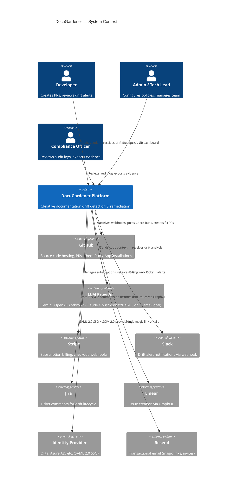
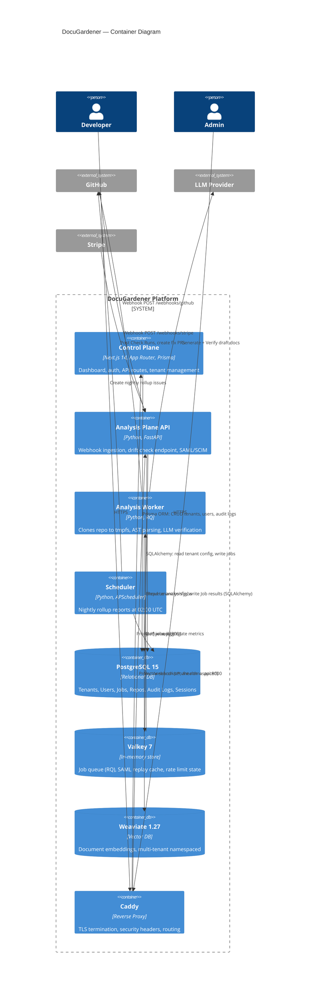
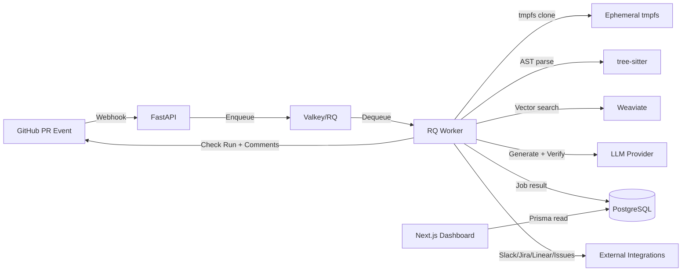

# SAD-01: System Context & Architecture Overview

> **Document ID:** SAD-01 | **Version:** 2.0 | **Date:** 2026-04-22
> **Status:** Current State + Known Gaps | **Classification:** Internal / Due Diligence
> **Author:** Solution Architecture | **Supersedes:** `docs/DocuGardener_Software_Architecture_Specification.md` (V1 draft)
> **Changelog v2.0:** Added Anthropic LLM provider; cross-repo drift detection (EPIC-11); SCIM 2.0 active; SEC-AUDIT-01 hardening reflected in ADRs + gap register.

---

## 1. Purpose & Scope

This document is the first of four in the DocuGardener Software Architecture Document (SAD) pack. It establishes the business context, stakeholder landscape, architectural constraints, quality goals, and high-level system decomposition.

### SAD Pack Navigation

| Document | Scope |
|----------|-------|
| **SAD-01 (this)** | System context, stakeholders, constraints, C4 Level 1+2, quality goals, ADRs |
| [SAD-02](SAD-02-Component-Data-Architecture.md) | Component decomposition, data model, API contracts, integration map |
| [SAD-03](SAD-03-Deployment-Operations.md) | Infrastructure topology, Docker/K8s/Helm, CI/CD, monitoring |
| [SAD-04](SAD-04-Security-Compliance.md) | Auth flows, RBAC, encryption, zero-retention, audit chain, threat model |

---

## 2. Business Context

### 2.1 Problem Statement

In modern DevOps, code moves fast. Documentation does not. For FinTech, MedTech, and Enterprise SaaS, this gap is not just technical debt — it is a **compliance risk**. When `api/payment.ts` changes but `docs/payments.md` doesn't, the result is "Documentation Drift" — a verifiable, auditable failure.

### 2.2 Product Vision

DocuGardener is a **CI-native documentation verification layer** that lives in the Pull Request workflow. It intercepts code changes, detects documentation drift via AST parsing and LLM verification, and either blocks the merge or auto-fixes the documentation.

**Core Positioning:** Deterministic where possible, model-assisted where useful, auditable everywhere.

### 2.3 Value Proposition

| Pillar | What It Means |
|--------|---------------|
| **Code-Coupling** | Docs are treated as a dependency of the code — not a separate artifact |
| **Continuous Verification** | Truth is verified at commit level, not release level |
| **Zero-Trust Security** | Source code is ephemeral — cloned to RAM, analyzed, wiped |

### 2.4 Target Market

- **Beachhead:** Regulated industries (FinTech, MedTech) where documentation accuracy is auditable
- **Expansion:** Platform engineering teams in enterprise SaaS
- **Adoption Model:** Bottom-up (developer adopts Free/Pro) → compliance team expands to Team plan

### 2.5 Go-to-Market Strategy

SaaS-first, free tier. No open-source community edition. GitHub Marketplace as primary acquisition channel. Stability target: 100 paying teams at $25-50/mo within 12-18 months.

---

## 3. Stakeholder Map

| Stakeholder | Concern | Addressed By |
|-------------|---------|--------------|
| **Developer** | Zero friction — don't slow down PRs | Auto-fix PRs, <2 min analysis, `!dgignore` bypass |
| **Tech Lead / Platform Engineer** | Fleet-wide documentation health visibility | Risk Map, Drift Velocity dashboard, nightly rollups |
| **Security / Compliance Officer** | Audit trail, data residency, SOC2 evidence | SHA-256 hash-chain audit log, evidence export, BYOK/air-gap |
| **CISO / Enterprise Buyer** | SSO, tenant isolation, zero data egress | SAML 2.0, SCIM 2.0, Weaviate namespace isolation, Ollama support |
| **Solo Founder (Operator)** | Sustainable unit economics, manageable ops | Platform LLM cap ($0.50/mo FREE), Stripe billing, Helm self-hosting |

---

## 4. Architectural Constraints

### 4.1 Hard Constraints

| ID | Constraint | Rationale |
|----|-----------|-----------|
| C-1 | Source code must never be persisted to disk | Zero-retention promise; compliance credibility |
| C-2 | Analysis must complete in <2 minutes per PR | Developer experience — blocking merges too long kills adoption |
| C-3 | Must support fully air-gapped deployment | Enterprise customers in regulated industries (defense, healthcare) |
| C-4 | Single founder operational complexity ceiling | Solo founder cannot operate Kafka, distributed tracing, etc. |
| C-5 | Tenant data isolation at every layer | Multi-tenant SaaS; vector bleed = compliance violation |

### 4.2 Technology Decisions (Rationale)

| Decision | Choice | Alternatives Considered | Why |
|----------|--------|------------------------|-----|
| Analysis runtime | Python (FastAPI) | Node.js, Go | Dominant AI/ML ecosystem, tree-sitter bindings, LLM SDKs |
| Control plane | Next.js (App Router) | Remix, SvelteKit | Superior DX, Prisma integration, NextAuth.js, Vercel-ready |
| Job queue | Redis (Valkey) + RQ | Celery, Kafka, BullMQ | Operational simplicity ceiling (C-4); sufficient throughput |
| Vector DB | Weaviate | Pinecone, Qdrant, pgvector | Native multi-tenancy, self-hostable, GraphQL API |
| Relational DB | PostgreSQL 15 | MySQL, CockroachDB | Prisma support, mature OLTP, Helm subchart available |
| Reverse proxy | Caddy | Nginx, Traefik | Automatic Let's Encrypt, minimal config, production-safe defaults |
| Container orchestration | Docker Compose (SaaS) + Helm (on-prem) | ECS, Nomad | Compose for single-node SaaS; Helm for enterprise K8s |

---

## 5. Quality Goals

Ordered by priority for the current product stage.

| Priority | Quality Goal | Measure | Current State |
|----------|-------------|---------|---------------|
| 1 | **Security / Data Privacy** | Zero code retention; encrypted credentials at rest | Implemented (AES-256-GCM); ephemeral tmpfs; gaps in encryption fallback (see SAD-04) |
| 2 | **Reliability** | PR analysis completes or fails gracefully; never silently drops | RQ job tracking; quota checks return safe defaults on DB errors |
| 3 | **Performance** | <2 min PR analysis; <500ms API response | Hardcoded 50-file cutoff; Prometheus histograms in place |
| 4 | **Auditability** | Every decision is logged and tamper-evident | SHA-256 hash chain; 21 audit event types; CSV/JSON export |
| 5 | **Operability** | Solo founder can deploy, monitor, and debug | Docker Compose one-command startup; Prometheus + Grafana; structured logging |
| 6 | **Extensibility** | New integrations without core refactoring | Dispatcher pattern for notifications; plugin API for IDE |

---

## 6. System Context (C4 Level 1)

---

## 7. Container View (C4 Level 2)

### 7.1 Two-Plane Architecture

The system is split into two independent planes:

| Plane | Runtime | Responsibility | Database Access |
|-------|---------|---------------|-----------------|
| **Control Plane** | Next.js 14 (Node.js) | UI, authentication, tenant CRUD, audit logging, billing | Prisma → PostgreSQL |
| **Analysis Plane** | Python FastAPI + RQ Workers | Webhook ingestion, AST parsing, LLM inference, GitHub API | SQLAlchemy → PostgreSQL |

Both planes share the same PostgreSQL instance. The Control Plane owns the schema (Prisma migrations); the Analysis Plane reads/writes via SQLAlchemy models that mirror the Prisma schema.

**Why two planes?** Python dominates the AI/ML ecosystem (tree-sitter bindings, LLM SDKs, embedding models). Next.js provides superior DX for the dashboard UI and integrates natively with NextAuth.js and Prisma. The planes communicate via shared database state rather than inter-service APIs — a deliberate simplicity decision for a solo-founder product.

### 7.3 Cross-Repo Drift Detection (EPIC-11, beta)

As of v2.0, the analysis pipeline can fan out document search across multiple repositories within the same tenant. When a code change lands in repo A, DocuGardener also searches embeddings in sibling repos B, C, … to surface drift in upstream/downstream documentation owned by the same tenant. Key guardrails:

- **Feature flag:** `cross_repo_beta` (env `CROSS_REPO_BETA`) — kill switch (`src/core/config.py`).
- **Namespacing:** each repo has a sub-namespace `{tenant_id}__{owner}__{repo_name}`; tenant isolation preserved (no cross-tenant search).
- **Sibling selection:** tenant configures explicit sibling list per repo via PATCH `/api/repos/[id]` (TEAM/ENTERPRISE plan gate).
- **LLM guardrails:** `valid_pairs` injection defence in `analyze_cross_repo_impact()`; confidence gate suppresses low-signal findings.
- **Plan gate:** Multi-Repo group on pricing matrix (TEAM+).

### 7.2 Data Flow Summary

---

## 8. Key Architectural Decisions (ADRs)

### ADR-01: Shared Database Instead of Inter-Service API

**Context:** The Control Plane (Next.js) and Analysis Plane (Python) need to exchange data (tenant config, job results).

**Decision:** Both planes access the same PostgreSQL database directly. No internal REST API between planes.

**Rationale:**
- Solo-founder constraint: one fewer service to deploy, monitor, and version
- Prisma and SQLAlchemy model the same schema — type safety maintained in both runtimes
- Database is the single source of truth; no eventual consistency between services

**Consequences:**
- Schema changes require coordinated updates in both `schema.prisma` and `sql_models.py`
- Cannot independently scale database access patterns per plane
- Future refactor to API boundary is possible but not currently prioritized

**Status:** Accepted. Revisit at >10 tenants or when adding a second developer.

---

### ADR-02: RQ Over Celery/Kafka for Job Processing

**Context:** PR analysis is CPU-bound and takes 30-120 seconds. Needs async processing.

**Decision:** Use RQ (Redis Queue) backed by Valkey.

**Rationale:**
- Celery adds broker complexity, flower monitoring, beat scheduler — overkill for solo founder
- Kafka is massively over-engineered for the expected throughput (<1000 PRs/day)
- RQ provides simple enqueue/dequeue, job status tracking, and retry semantics
- Valkey (MIT-licensed Redis fork) avoids SSPL licensing risk

**Consequences:**
- No native priority queues (queue names "high"/"low" defined but not enforced)
- No built-in dead letter queue — failed jobs require manual inspection
- Single-threaded worker per process — horizontal scaling via replica count

**Status:** Accepted.

---

### ADR-03: Weaviate Multi-Tenancy for Vector Isolation

**Context:** Multiple tenants store document embeddings. Cross-tenant query leakage = compliance violation.

**Decision:** Use Weaviate's native multi-tenancy feature with tenant-namespaced shards.

**Rationale:**
- Weaviate provides built-in tenant sharding — each tenant's data is physically isolated
- Collection name: `DocuGardenerTenantV1`; each tenant gets an independent shard via `collection.with_tenant(namespace)`
- Self-hostable (required for air-gap deployments) unlike Pinecone
- Alternative (pgvector) would couple vector and relational workloads

**Consequences:**
- Weaviate adds an additional container to the deployment footprint
- Tenant shard creation is lazy (on first write) — no upfront provisioning
- Schema versioning is manual (collection name includes version)

**Status:** Accepted.

---

### ADR-04: Two-Stage LLM Verification (Generator + Verifier)

**Context:** LLMs hallucinate. Documentation updates based on hallucinated content are worse than no update.

**Decision:** Separate the LLM pipeline into a Generator (creative) and Verifier (strict) stage.

**Rationale:**
- Generator produces documentation drafts with normal temperature
- Verifier re-evaluates drafts against actual code at Temperature=0
- If Verifier rejects: drift is flagged but no auto-fix is offered
- Grace threshold (50% confidence): below this, merge block is lifted automatically

**Consequences:**
- Doubles LLM cost per analysis (two inference calls)
- Adds latency (serial execution of two LLM calls)
- Verifier false negatives still possible — mitigated by human triage in Inbox

**Status:** Accepted.

---

### ADR-05: SaaS-First, No Open-Source Community Edition

**Context:** Market entry strategy. Should DocuGardener offer an OSS tier?

**Decision:** No OSS edition. SaaS-first with a generous free tier.

**Rationale:**
- OSS splits engineering resources between community support and product development
- Free tier provides "aha moment" in <5 minutes (GitHub App install → first PR → check run)
- OSS creates pricing pressure and self-hosting support burden for a solo founder
- Revisit conditions: >100 paying customers + SOC2 in progress + pull-based enterprise demand

**Status:** Accepted (2026-03-12). See `docs/specs/GTM-09-SaaS-First-Bootstrap-Strategy.md`.

---

### ADR-06: Caddy Over Nginx for TLS Termination

**Context:** Need a reverse proxy for production deployment with automatic TLS.

**Decision:** Use Caddy with automatic Let's Encrypt certificate management.

**Rationale:**
- Automatic HTTPS with zero configuration (just provide domain name)
- Built-in security headers with sensible defaults
- Single binary, no lua modules or certbot cron jobs
- Caddyfile is ~20 lines vs Nginx equivalent at ~60+ lines

**Status:** Accepted.

---

### ADR-07: Cross-Repo Drift as Feature-Flagged Beta (EPIC-11)

**Context:** Tenants hosting microservices have documentation spread across repos. A change to `payments-api` may invalidate docs in `payments-docs` or `client-sdk`.

**Decision:** Implement multi-namespace Weaviate fan-out behind `CROSS_REPO_BETA` kill switch, gated to TEAM+ plans, with explicit tenant-controlled sibling lists.

**Rationale:**
- Kill switch allows emergency disable without deploy
- Explicit sibling opt-in prevents surprise cross-repo noise
- `valid_pairs` injection defence in the verifier blocks prompt-injection escalations across repo boundaries
- Hard stop on tenants whose namespace collection is empty (prevents silent leakage attempts)

**Status:** Accepted (2026-04-19, shipped 2026-04-20). Pending GA promotion post-beta feedback.

---

### ADR-08: Anthropic as Third Managed LLM Provider

**Context:** Customers in regulated industries increasingly standardise on Claude for compliance reasons (Anthropic's usage policies, constitutional-AI framing).

**Decision:** Add Anthropic as a first-class provider alongside Gemini and OpenAI, with full BYOK support (Claude Opus 4.7, Sonnet 4.6, Haiku 4.5).

**Rationale:**
- Regulated-industry preference and MSA alignment
- Transient-error handling (HTTP 529) already codified in `_TRANSIENT_HTTP_CODES`
- Provider-agnostic `LLMProvider` enum required zero pipeline refactor — only a new `AnthropicClient` in `src/agents/llm.py`

**Status:** Accepted (2026-03-28).

---

## 9. Known Gaps & Planned Work

Based on SA Assessment (2026-03-12) + SEC-AUDIT-01 (2026-04-21) sprint.

| ID | Gap | Severity | Status | Reference |
|----|-----|----------|--------|-----------|
| GAP-SEC-08 | GitHub installation tokens use `lru_cache` without TTL awareness | P1 | Planned | Backlog SEC-08 |
| GAP-OPS-03 | No automated deploy workflow in GitHub Actions | P2 | Workaround: manual SSH deploy | Backlog OPS-03 |
| GAP-SEC-P2-1 | `allowDangerousEmailAccountLinking: true` in NextAuth | P2 | Documented risk; `ACCOUNT_LINKED` audit event added | SA Assessment P2-1 |
| GAP-MKTG-01 | VS Code Marketplace listing pending | P2 | Blocks public gate | MKTG-01 |
| GAP-QA-INSTALL-01 | Install QA ~70% complete | P2 | Blocks public gate | QA-INSTALL-01 |

**Closed since v1.0:**
- P0-1 (secret material in Git) — remediated
- P0-2 (encryption fallback) — startup guard enforced
- P0-3 (tenant middleware logging only) — strict enforcement shipped in SEC-AUDIT-01
- OPS-02 (Valkey in prod) — superseded by Valkey adoption + PgBouncer introduction
- SEC-AUDIT-01 (8 items: H1 SECURITY.md, H2 port-binding, H3 SSO oracle+rate-limit, H4 webhook fail-closed, M1 CORS no-wildcard, M2 Swagger gate, M3 CORS explicit headers, M5 stray file)

See [SAD-04](SAD-04-Security-Compliance.md) for detailed security gap analysis.

---

## 10. Glossary

| Term | Definition |
|------|-----------|
| **Drift** | A measurable divergence between code semantics and documentation content |
| **Drift Score** | Numeric severity (0-100) indicating magnitude of documentation drift |
| **Check Run** | GitHub API feature that reports pass/fail status on a PR commit |
| **Triage** | Human decision to Accept (auto-fix), Ignore (dismiss), or Resolve a drift alert |
| **BYOK** | Bring Your Own Key — tenant provides their own LLM API credentials |
| **Air-Gap** | Deployment mode where no data leaves the customer's network perimeter |
| **Blast Radius** | Number of downstream dependencies affected by a code entity change |
| **Fix PR** | Auto-generated Pull Request containing documentation updates |
| **Nightly Rollup** | Scheduled job aggregating drift metrics into GitHub Issues |
| **Evidence Pack** | Exportable audit artifact proving documentation compliance for a time period |
| **Hash Chain** | SHA-256 linked audit log where each entry incorporates the previous entry's hash |

---

*Next: [SAD-02 — Component & Data Architecture](SAD-02-Component-Data-Architecture.md)*
