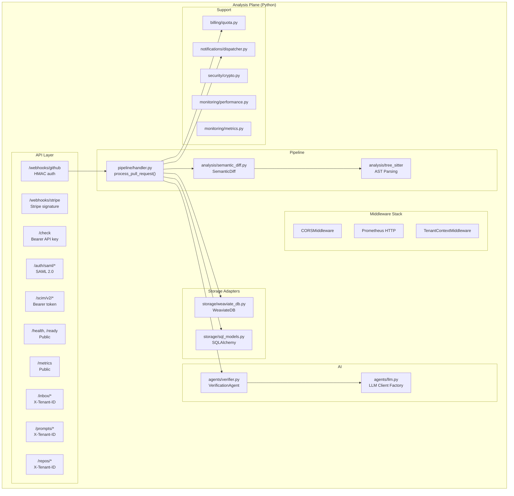
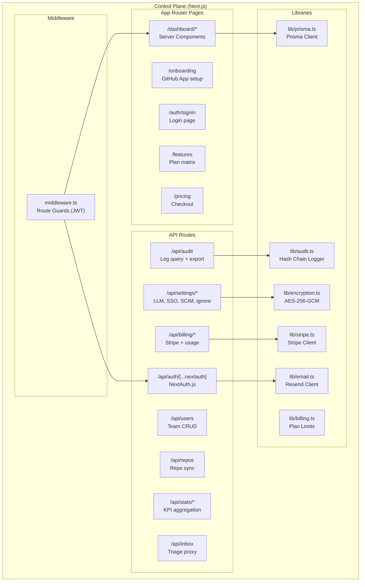
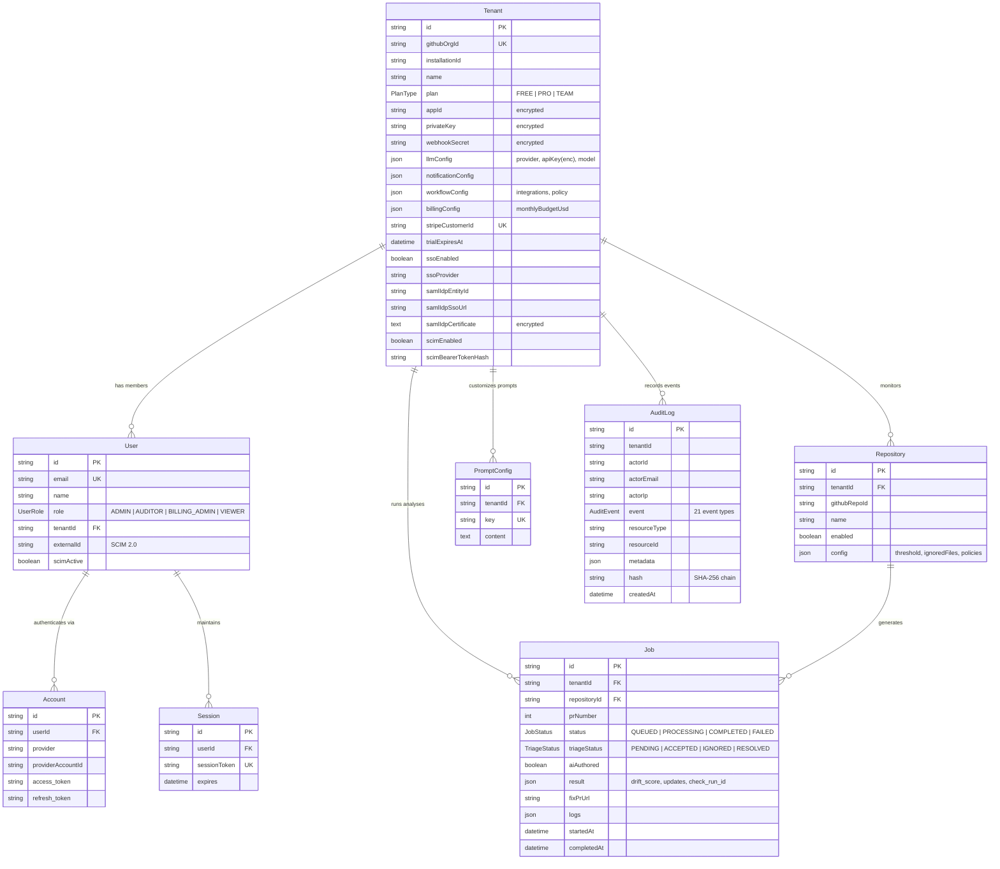
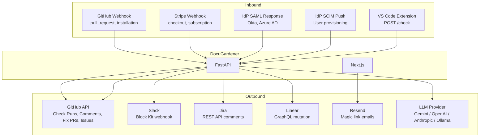
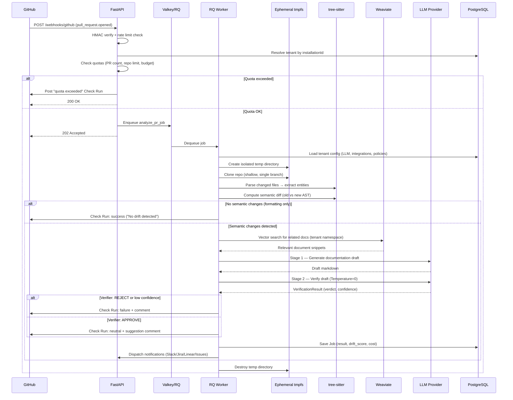

# SAD-02: Component & Data Architecture

> **Document ID:** SAD-02 | **Version:** 1.0 | **Date:** 2026-03-12
> **Status:** Current State + Known Gaps | **Classification:** Internal / Due Diligence

---

## 1. Component Decomposition (C4 Level 3)

### 1.1 Analysis Plane — Python FastAPI



### 1.2 Control Plane — Next.js



---

## 2. Component Catalog

### 2.1 Analysis Plane Components

| Component | File(s) | Responsibility | Dependencies |
|-----------|---------|----------------|-------------|
| **Webhook Handler** | `src/api/webhooks.py` | GitHub event ingestion, HMAC verification, rate limiting, quota checks, job enqueuing | Redis/RQ, SQLAlchemy, quota module |
| **Stripe Webhook** | `src/stripe/webhooks.py` | Billing event processing (checkout, subscription update/cancel) | Stripe SDK, SQLAlchemy |
| **Plugin Check API** | `src/api/check.py` | Stateless drift check for VS Code extension | SemanticDiff, VerificationAgent |
| **SAML Handler** | `src/api/saml.py` | SP-initiated SSO, ACS callback, metadata, logout | python3-saml, Redis (replay cache) |
| **SCIM Handler** | `src/api/scim.py` | RFC 7644 user provisioning (CRUD, filter, deactivate) | SQLAlchemy |
| **Inbox API** | `src/api/inbox.py` | Triage CRUD, fix-PR dispatch, ignore-drift dispatch | SQLAlchemy, RQ |
| **Pipeline Handler** | `src/pipeline/handler.py` | Orchestrates full PR analysis flow | All analysis components |
| **Semantic Diff** | `src/analysis/semantic_diff.py` | AST-based change detection using tree-sitter | tree-sitter grammars |
| **Verification Agent** | `src/agents/verifier.py` | Two-stage LLM pipeline (Generator + Verifier) | LLM Client, Weaviate |
| **LLM Client Factory** | `src/agents/llm.py` | Provider-agnostic LLM invocation (Gemini, OpenAI, Anthropic, Ollama) | Provider SDKs |
| **Notification Dispatcher** | `src/notifications/dispatcher.py` | Fan-out to Slack, Jira, Linear, GitHub Issues | httpx, GitHub API |
| **Quota Enforcement** | `src/billing/quota.py` | Plan-based PR/repo limits with trial awareness | SQLAlchemy |
| **Crypto Module** | `src/security/crypto.py` | AES-256-GCM encrypt/decrypt for tenant secrets | cryptography lib |
| **Metrics Collector** | `src/monitoring/metrics.py` | Prometheus counters, histograms, gauges (20+ metrics) | prometheus_client |
| **Rate Limiter** | `src/monitoring/performance.py` | Token-bucket rate limiting, TTL cache, decorators | Built-in |
| **Scheduler** | `src/scheduler/manager.py` | APScheduler-based nightly rollup (02:00 UTC) | APScheduler, SQLAlchemy |
| **SQL Models** | `src/storage/sql_models.py` | SQLAlchemy ORM mirroring Prisma schema | SQLAlchemy |
| **Weaviate Client** | `src/storage/weaviate_db.py` | Multi-tenant vector DB operations | weaviate-client |

### 2.2 Control Plane Components

| Component | File(s) | Responsibility |
|-----------|---------|----------------|
| **NextAuth Handler** | `web/app/api/auth/[...nextauth]/route.ts` | Multi-provider auth (GitHub, Email, SAML, Dev) |
| **User Management** | `web/app/api/users/route.ts` | CRUD users, role assignment, seat enforcement |
| **Repo Management** | `web/app/api/repos/route.ts` | GitHub App discovery, sync, enable/disable |
| **Billing API** | `web/app/api/billing/*.ts` | Cost breakdown, budget, Stripe checkout/portal, trial |
| **Audit API** | `web/app/api/audit/route.ts` | Paginated log query, CSV/JSON export |
| **Settings API** | `web/app/api/settings/*.ts` | LLM config, SSO, SCIM, ignore rules, environment profile |
| **Stats API** | `web/app/api/stats/*.ts` | Dashboard KPIs, activity timeline, ignore counts |
| **Audit Logger** | `web/lib/audit.ts` | SHA-256 hash chain event logging |
| **Encryption Module** | `web/lib/encryption.ts` | AES-256-GCM (mirrors Python implementation) |
| **Billing Logic** | `web/lib/billing.ts` | Plan limit constants, `canAddUser()` checks |
| **Middleware** | `web/middleware.ts` | JWT-based route guards per role |

---

## 3. Data Model

### 3.1 Entity Relationship Diagram



### 3.2 Schema Ownership

| Owner | ORM | Models | Migration Strategy |
|-------|-----|--------|-------------------|
| Control Plane (Next.js) | Prisma | All models (authoritative schema) | `npx prisma migrate dev` |
| Analysis Plane (Python) | SQLAlchemy | Mirror of Prisma models (read/write) | No migrations — follows Prisma schema |

**Important:** The Prisma schema (`web/prisma/schema.prisma`) is the single source of truth. The SQLAlchemy models (`src/storage/sql_models.py`) must be kept in sync manually when schema changes occur.

### 3.3 Key JSON Column Schemas

#### `Tenant.llmConfig`
```json
{
  "provider": "gemini | openai | anthropic | ollama",
  "apiKey": "encrypted-string",
  "baseUrl": "https://...",
  "modelName": "gemini-2.0-flash",
  "promptTone": "strict | helpful | neutral"
}
```

#### `Tenant.workflowConfig`
```json
{
  "pluginApiKey": "dg_xxx",
  "ignoredActors": ["dependabot[bot]"],
  "aiAuthorPatterns": ["copilot", "cursor"],
  "slack": { "webhookUrl": "encrypted" },
  "jira": { "baseUrl": "...", "email": "...", "apiToken": "encrypted" },
  "linear": { "apiToken": "encrypted", "teamId": "..." },
  "githubIssues": { "enabled": true },
  "policies": [
    { "path": "src/api/**", "require_docs": ["docs/api/**"], "enforcement": "blocking" }
  ]
}
```

#### `Tenant.billingConfig`
```json
{
  "monthlyBudgetUsd": 10.0
}
```

#### `Job.result`
```json
{
  "drift_score": 75,
  "severity": "significant",
  "block_merge": true,
  "summary": "...",
  "documentation_updates": [...],
  "entity_changes": [...],
  "check_run_id": 12345,
  "confidence_score": 0.85,
  "recheck_status": "verified",
  "llm_usage": { "input_tokens": 2400, "output_tokens": 800, "cost_usd": 0.0012 },
  "policy_violations": [...],
  "issue_number": 42,
  "jira_ticket_key": "PROJ-123"
}
```

---

## 4. API Contract Summary

### 4.1 Analysis Plane Endpoints (FastAPI)

| Method | Path | Auth | Purpose |
|--------|------|------|---------|
| POST | `/webhooks/github` | HMAC-SHA256 | GitHub webhook ingestion |
| POST | `/webhooks/stripe` | Stripe-Signature | Billing webhook |
| POST | `/check` | Bearer API key | VS Code drift check |
| GET | `/health` | Public | Liveness probe |
| GET | `/ready` | Public | Readiness probe |
| GET | `/metrics` | Public | Prometheus scrape |
| GET | `/inbox/` | X-Tenant-ID | List pending drift alerts |
| GET | `/inbox/{job_id}` | X-Tenant-ID | Get job details |
| PATCH | `/inbox/{job_id}` | X-Tenant-ID | Update triage status |
| GET | `/prompts/` | X-Tenant-ID | List prompts |
| POST | `/prompts/{key}` | X-Tenant-ID | Update prompt (SEC-02 guarded) |
| GET | `/repos/{owner}/{repo}/contents/{path}` | X-Tenant-ID | File content proxy |
| GET | `/auth/saml/metadata` | Public | SP metadata XML |
| GET | `/auth/saml/login` | Public | Initiate SSO |
| POST | `/auth/saml/callback` | SAML assertion | ACS endpoint |
| GET/POST/PUT/PATCH/DELETE | `/scim/v2/*` | Bearer token | User provisioning (RFC 7644) |

### 4.2 Control Plane Endpoints (Next.js API Routes)

| Method | Path | Role | Purpose |
|--------|------|------|---------|
| POST/GET | `/api/auth/[...nextauth]` | Public | Authentication providers |
| GET | `/api/users` | ADMIN | List team members |
| POST | `/api/users` | ADMIN | Invite user (magic link) |
| PATCH/DELETE | `/api/users/[id]` | ADMIN | Update role / remove |
| GET/POST | `/api/repos` | Any | List / sync repositories |
| PATCH/DELETE | `/api/repos/[id]` | ADMIN | Toggle / delete repo |
| GET | `/api/billing` | Any | Usage + cost breakdown |
| GET/POST | `/api/billing/settings` | ADMIN/BILLING_ADMIN | Budget management |
| POST | `/api/billing/checkout` | ADMIN | Create Stripe session |
| POST | `/api/billing/portal` | ADMIN/BILLING_ADMIN | Stripe customer portal |
| GET/POST | `/api/billing/trial` | ADMIN | Trial management |
| GET | `/api/audit` | ADMIN/AUDITOR | Paginated audit logs |
| GET | `/api/audit/export` | ADMIN/AUDITOR | CSV/JSON export |
| POST | `/api/settings` | ADMIN | Update LLM, integrations |
| GET | `/api/settings/route` | Any | Read current settings |
| POST | `/api/settings/test-llm` | ADMIN | Test LLM connection |
| GET | `/api/settings/models` | ADMIN | List available LLM models |
| GET/POST | `/api/settings/sso` | ADMIN | SAML configuration |
| GET/POST | `/api/settings/scim` | ADMIN | SCIM token management |
| GET | `/api/settings/environment-profile` | ADMIN (TEAM) | Sanitized env export |
| GET | `/api/stats/summary` | Any | Dashboard KPIs |
| GET | `/api/stats/activity` | Any | Activity timeline |
| POST | `/api/simulation` | ADMIN | Dry-run drift analysis |
| GET/POST/DELETE | `/api/plugin-key` | ADMIN | IDE plugin key management |

---

## 5. Integration Architecture

### 5.1 Integration Map



### 5.2 Integration Details

| Integration | Protocol | Auth | Plan Gate | Lifecycle |
|-------------|----------|------|-----------|-----------|
| **GitHub** (inbound) | Webhook POST | HMAC-SHA256 | All | installation.created → PR analysis → check run |
| **GitHub** (outbound) | REST API v3 | Installation token | All | Check Runs, PR comments, fix PRs, issue create/close |
| **Stripe** | Webhook POST + API | Stripe-Signature / sk_key | All | checkout.completed → sync plan → subscription events |
| **Slack** | Webhook POST | Webhook URL (encrypted) | PRO+ | Block Kit drift alert card |
| **Jira** | REST API POST | Basic auth (email + token) | PRO+ | Comment on existing ticket (key from PR branch/title/body) |
| **Linear** | GraphQL mutation | Bearer token | PRO+ | Create issue in auto-resolved team |
| **GitHub Issues** | REST API v3 | Installation token | All | Create/close drift issues; lifecycle tracked via Job.result |
| **SAML 2.0** | XML/POST | Certificate-based assertion | TEAM | SP-initiated SSO; exchange token → NextAuth session |
| **SCIM 2.0** | REST API (RFC 7644) | Bearer token (SHA-256 hashed) | TEAM | User CRUD, deactivation, role sync |
| **Resend** | REST API | API key | All | Magic link emails, invite emails |
| **Ollama** | HTTP API | None (local) | All | Air-gapped LLM inference |

### 5.3 Notification Dispatcher Pattern

The `NotificationDispatcher` class implements a fan-out pattern:

1. Pipeline handler calls `dispatch_drift_alert(drift_record, jira_ticket_key)`
2. Dispatcher checks tenant plan (FREE = GitHub Issues only)
3. For each enabled channel, dispatcher calls the appropriate method
4. Each channel is independently error-handled — one failure doesn't block others
5. On fix-PR merge: `close_github_issue()`, `post_jira_lifecycle_comment()`

---

## 6. Analysis Pipeline Flow



### 6.1 Pipeline Guards (Execution Order)

| Order | Guard | Action on Fail |
|-------|-------|----------------|
| 1 | HMAC signature verification | 401 Unauthorized |
| 2 | Rate limiter (20 req/min per installation) | 429 Too Many Requests |
| 3 | Loop prevention (`docugardener-fix-*` branch) | 200 OK (skip silently) |
| 4 | Actor filtering (ignored actors list) | 200 OK (skip silently) |
| 5 | Repository enabled check | 200 OK (skip silently) |
| 6 | PR quota check | Post quota-exceeded Check Run |
| 7 | Repo quota check | Post quota-exceeded Check Run |
| 8 | Budget guard (platform LLM cap) | Post budget-exceeded Check Run |
| 9 | AI author detection | Set `aiAuthored=true` flag |
| 10 | Policy evaluation (DOCPOL-01) | Include policy violations in result |

---

## 7. Vector Database Architecture

### 7.1 Collection Schema

| Property | Type | Purpose |
|----------|------|---------|
| `content` | TEXT | Document text (for embedding) |
| `file_path` | TEXT | Source file path in repository |
| `entity_name` | TEXT | Function/class/API name |
| `entity_type` | TEXT | function, class, endpoint, etc. |
| `doc_type` | TEXT | markdown, openapi, readme, etc. |
| `record_id` | TEXT | Deduplication key |

### 7.2 Multi-Tenancy Model

- **Collection:** `DocuGardenerTenantV1` (single collection, multi-tenant)
- **Isolation:** Weaviate native `multi_tenancy(enabled=True)`
- **Shard creation:** Lazy — first write creates tenant shard
- **Query scoping:** `collection.with_tenant(tenant_id)` ensures namespace isolation
- **Embedding model:** `all-MiniLM-L6-v2` (local, no external API dependency)

---

## 8. Cross-Cutting Concerns

### 8.1 Observability (Prometheus Metrics)

| Category | Metrics | Cardinality Notes |
|----------|---------|-------------------|
| **HTTP** | `requests_total`, `request_duration_seconds` | Path normalized (UUIDs → `{id}`) |
| **Webhooks** | `received_total`, `processed_total`, `failed_total` | By event_type |
| **Analysis** | `analyses_total`, `analysis_duration_seconds`, `drift_score` | By repo, severity |
| **LLM** | `requests_total`, `latency_seconds`, `errors_total` | By provider, model, purpose |
| **Vector DB** | `operations_total`, `latency_seconds` | By provider, operation |
| **Business** | `active_tenants`, `quota_usage_ratio`, `queue_size`, `processing_jobs` | By tier, tenant_id |

### 8.2 Error Handling Philosophy

| Layer | Strategy | Rationale |
|-------|----------|-----------|
| Webhook handler | Log + return 200 | Never let transient errors cause GitHub retry storms |
| Quota checks | Return `(True, "")` on DB errors | Don't block webhooks due to DB hiccups |
| LLM calls | Retry with backoff; fallback to lower confidence | LLM errors are transient; graceful degradation preferred |
| Notifications | Catch + log; don't propagate | A Slack failure shouldn't block the analysis result |
| Encryption | Fail hard in production if key missing | Security failures must be loud |

---

*Previous: [SAD-01 — System Context](SAD-01-System-Context.md) | Next: [SAD-03 — Deployment & Operations](SAD-03-Deployment-Operations.md)*
