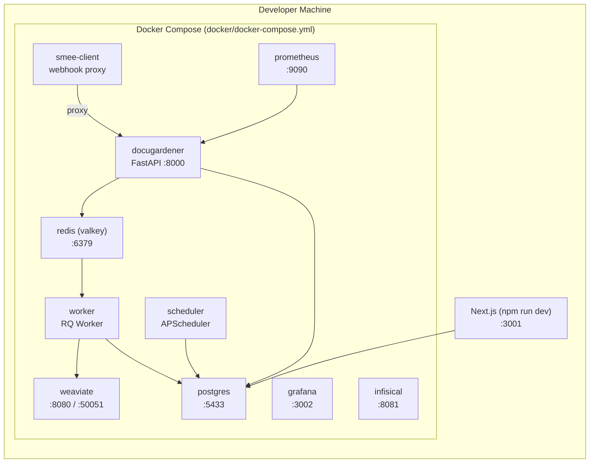
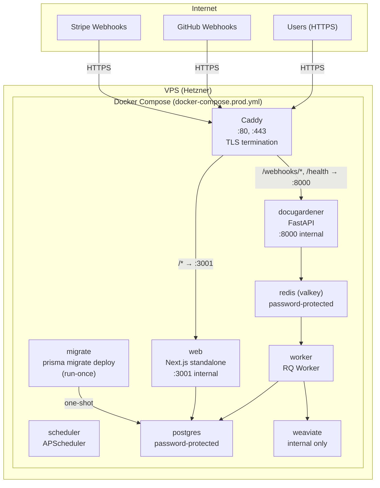
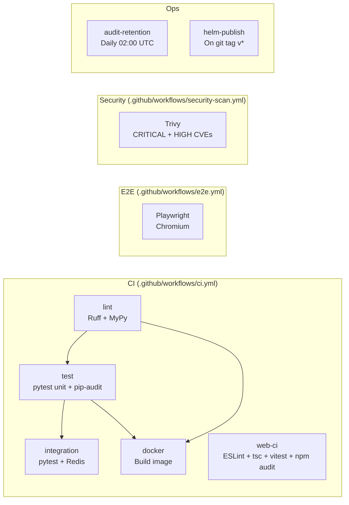
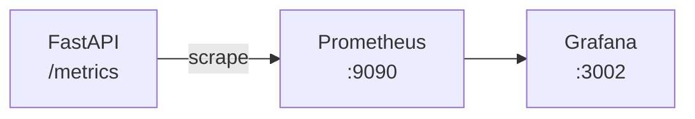

# SAD-03: Deployment & Operations

> **Document ID:** SAD-03 | **Version:** 1.1 | **Date:** 2026-03-13
> **Status:** Current State + Known Gaps + Hetzner Scaling Roadmap | **Classification:** Internal / Due Diligence

---

## 1. Deployment Topology

DocuGardener supports three deployment modes, progressing from development to enterprise on-premises.

| Mode | Target | Orchestration | TLS | Secrets |
|------|--------|--------------|-----|---------|
| **Development** | Local workstation | `docker-compose.yml` | None (HTTP) | `.env` file |
| **Production SaaS** | Single VPS (Hetzner) | `docker-compose.prod.yml` | Caddy + Let's Encrypt | `.env` + `secrets/` |
| **Enterprise On-Prem** | Customer Kubernetes | Helm chart (`helm/docugardener/`) | Customer ingress | External Secrets Operator / Vault |

---

## 2. Development Environment

### 2.1 Service Topology



### 2.2 Port Allocation

| Service | Host Port | Container Port | Notes |
|---------|-----------|----------------|-------|
| FastAPI | 8000 | 8000 | Analysis Plane API |
| Next.js | 3001 | 3000 | Control Plane (avoids SkillSeal conflict) |
| PostgreSQL | 5433 | 5432 | Non-standard to avoid SkillSeal conflict |
| Valkey/Redis | 6379 | 6379 | Job queue |
| Weaviate | 8080, 50051 | 8080, 50051 | REST + gRPC |
| Prometheus | 9090 | 9090 | Metrics scraping |
| Grafana | 3002 | 3000 | Dashboards (admin/admin) |
| Infisical | 8081 | 8080 | Secrets management (optional) |

### 2.3 Volume Mounts

| Volume | Container Path | Purpose |
|--------|---------------|---------|
| `../src:/app/src:ro` | All Python services | Hot-reload source code |
| `/tmp/docugardener:size=512M` | Worker | Ephemeral tmpfs for repo cloning |
| `postgres-data` | PostgreSQL | Persistent database storage |
| `weaviate-data` | Weaviate | Persistent vector storage |
| `prometheus-data` | Prometheus | Metrics retention |

### 2.4 Development Startup Sequence

```bash
# 1. Start infrastructure + analysis plane
docker-compose -f docker/docker-compose.yml up -d

# 2. Start control plane (separate terminal)
cd web && npm install && npx prisma migrate dev && npm run dev

# 3. Verify
curl http://localhost:8000/health    # FastAPI
open http://localhost:3001           # Dashboard
```

---

## 3. Production SaaS Deployment

### 3.1 Service Topology



### 3.2 Key Production Differences

| Aspect | Development | Production |
|--------|------------|------------|
| TLS | None (HTTP) | Caddy auto-TLS (Let's Encrypt) |
| Host port bindings | All services exposed | Only Caddy :80/:443 exposed |
| Redis auth | No password | `REDIS_PASSWORD` required |
| Postgres auth | Default password | `POSTGRES_PASSWORD` from env |
| Source mounting | Host-mounted (`../src:ro`) | Baked into Docker image |
| Webhook proxy | smee-client | Direct GitHub webhook delivery |
| Next.js mode | `npm run dev` (hot reload) | `standalone` output (optimized) |
| Database migration | `prisma migrate dev` | `prisma migrate deploy` (run-once container) |
| CORS | `["*"]` fallback | Explicit `ALLOWED_ORIGINS` required |
| Encryption key | Fallback to dev key | Must be set or startup fails |

### 3.3 Caddy Reverse Proxy Configuration

```
{DOMAIN} {
    header {
        Strict-Transport-Security "max-age=63072000; includeSubDomains; preload"
        X-Content-Type-Options "nosniff"
        X-Frame-Options "DENY"
        Referrer-Policy "strict-origin-when-cross-origin"
        Permissions-Policy "geolocation=(), microphone=(), camera=()"
        -Server
    }

    handle /webhooks/* { reverse_proxy docugardener:8000 }
    handle /health     { reverse_proxy docugardener:8000 }
    handle /metrics    { reverse_proxy docugardener:8000 }
    handle /auth/saml/* { reverse_proxy docugardener:8000 }
    handle /scim/v2/*  { reverse_proxy docugardener:8000 }
    handle /check      { reverse_proxy docugardener:8000 }
    handle             { reverse_proxy web:3001 }
}
```

### 3.4 Docker Image Build

#### FastAPI Backend (`docker/Dockerfile`)
- Base: `python:3.13-slim`
- Multi-stage: dependencies → app copy
- Non-root user execution
- Health check: `curl http://localhost:8000/health`

#### Next.js Frontend (`docker/Dockerfile.web`)
- Base: `node:20-alpine`
- 3-stage build: dependencies → build → standalone
- `output: "standalone"` in `next.config.ts`
- Copies only `standalone/` + `static/` + `public/` to final stage

---

## 4. Enterprise On-Premises (Kubernetes / Helm)

### 4.1 Chart Structure

```
helm/docugardener/
├── Chart.yaml              # Chart metadata + optional subcharts
├── values.yaml             # Default configuration
├── templates/
│   ├── _helpers.tpl        # Template helpers
│   ├── configmap.yaml      # Non-sensitive configuration
│   ├── deployment-api.yaml # FastAPI Deployment
│   ├── deployment-web.yaml # Next.js Deployment
│   ├── deployment-worker.yaml # RQ Worker Deployment
│   ├── deployment-scheduler.yaml # APScheduler (Recreate strategy)
│   ├── hpa.yaml            # HorizontalPodAutoscaler (optional)
│   ├── ingress.yaml        # Ingress (optional)
│   ├── networkpolicy.yaml  # Default-deny + component allowlists
│   ├── pdb.yaml            # PodDisruptionBudgets
│   ├── service.yaml        # ClusterIP services
│   ├── serviceaccount.yaml # Namespaced ServiceAccount
│   └── rbac.yaml           # Role + RoleBinding
```

### 4.2 Security Posture (PSA Restricted)

All pods enforce:
- `runAsNonRoot: true`
- `readOnlyRootFilesystem: true`
- `capabilities.drop: [ALL]`
- `seccompProfile: RuntimeDefault`
- `/tmp` served by in-memory `emptyDir`

### 4.3 Scaling Defaults

| Component | Replicas | CPU Request | Memory Request | CPU Limit | Memory Limit | HPA Target |
|-----------|----------|-------------|----------------|-----------|-------------|------------|
| API | 2 | 200m | 256Mi | 1000m | 1Gi | 70% CPU, 80% mem |
| Worker | 2 | 500m | 512Mi | 2000m | 2Gi | 60% CPU |
| Scheduler | 1 | 100m | 128Mi | 500m | 512Mi | N/A (singleton) |
| Web | 2 | 200m | 256Mi | 1000m | 1Gi | 70% CPU |

**Scheduler singleton:** Uses `strategy: Recreate` to prevent duplicate nightly rollup jobs.

### 4.4 Network Policies

Default-deny with per-component allowlists:

| Component | Allowed Ingress | Allowed Egress |
|-----------|----------------|----------------|
| API | Ingress controller :8000 | PostgreSQL :5432, Redis :6379, Weaviate :8080, External (GitHub, LLM) |
| Worker | None (pull-based) | PostgreSQL :5432, Redis :6379, Weaviate :8080, External (GitHub, LLM) |
| Scheduler | None | PostgreSQL :5432, External (GitHub) |
| Web | Ingress controller :3001 | PostgreSQL :5432 |

### 4.5 Secret Management

**Pattern:** `existingSecret` — the chart never creates secrets by default.

```yaml
secrets:
  existingSecret: "docugardener-secrets"  # Pre-created K8s Secret
  keys:
    databaseUrl: DATABASE_URL
    redisUrl: REDIS_URL
    geminiApiKey: GEMINI_API_KEY
    githubAppId: GITHUB_APP_ID
    githubPrivateKey: GITHUB_PRIVATE_KEY
    encryptionKey: ENCRYPTION_KEY
    nextauthSecret: NEXTAUTH_SECRET
```

Recommended operators: Sealed Secrets, HashiCorp Vault + External Secrets Operator, AWS Secrets Manager.

### 4.6 Air-Gap Deployment

All `image.repository` values are configurable. `global.imageRegistry` prefixes all images from a single override:

```yaml
global:
  imageRegistry: "registry.internal.corp:5000"
```

Combined with `llm_provider: ollama` and `ollama_url` pointing to an internal Ollama instance, this enables a fully air-gapped deployment.

### 4.7 Chart Distribution

Published via `helm push` to `oci://ghcr.io/docugardener/helm/` and signed with `cosign` on every `main` merge.

---

## 5. CI/CD Pipelines

### 5.1 Pipeline Overview



### 5.2 CI Pipeline Detail

| Job | Trigger | Steps | Quality Gate |
|-----|---------|-------|--------------|
| **lint** | Push/PR to main/develop | Ruff lint + format, MyPy type check | Zero errors |
| **test** | After lint | pytest unit (704 tests), pip-audit, Codecov | `--cov-fail-under=70` |
| **integration** | After test | pytest integration against Valkey service | Pass/fail |
| **web-ci** | Push/PR to main | ESLint, `tsc --noEmit`, vitest (381 tests), npm audit | Lines/functions/statements: 70%, branches: 60% |
| **docker** | After lint + test | BuildKit image build (no push) | Build succeeds |
| **e2e** | Push/PR to main | Prisma migrate + seed + Playwright (37/51 passing) | Soft gate (report artifact) |
| **security-scan** | Push/PR + weekly Monday | Trivy CRITICAL/HIGH CVE scan | SARIF upload to GitHub Security |
| **audit-retention** | Daily 02:00 UTC | POST to `/api/admin/audit/retain` | 200 OK |
| **helm-publish** | Git tag `v*` | Helm package + push to OCI registry | Cosign signature |

### 5.3 Test Suite Summary

| Suite | Framework | Count | Coverage | Location |
|-------|-----------|-------|----------|----------|
| Python unit | pytest | 704 passing, 2 infra failures | 70% floor enforced | `tests/unit/` |
| Python integration | pytest | Variable | Not separately measured | `tests/integration/` |
| Next.js unit | Vitest | 381 passing | 70% lines, 60% branches | `web/__tests__/` |
| E2E | Playwright | 37/51 passing | N/A | `web/e2e/` |

**Known pre-existing E2E failures (6):** SPEC-RBAC-03, SPEC-SSO-01/02, SPEC-TEAM-02, SPEC-GAPE-01/02

### 5.4 Known CI/CD Gaps

| Gap | Impact | Status |
|-----|--------|--------|
| No automated production deploy workflow | Manual SSH deployment | Blocked on ORGA-01 (entity registration) |
| No IaC scanning (Terraform, Helm lint) | Helm chart validation not gated | Not started |
| E2E not blocking (37/51 passing) | UI regressions can ship | Needs test stabilization |
| Production compose still uses `redis:7-alpine` | Valkey migration incomplete in prod | Planned (OPS-02) |

---

## 6. Monitoring & Observability

### 6.1 Metrics Stack



**Prometheus Configuration** (`docker/prometheus.yml`):
- Scrape interval: 15s
- Target: `docugardener:8000/metrics`

**Key Dashboard Panels** (Grafana):
- Webhook ingestion rate by event type
- Analysis duration histogram (p50, p95, p99)
- LLM latency by provider
- Drift score distribution
- Queue depth and active jobs
- Tenant quota usage

### 6.2 Logging

| Component | Log Format | Destination |
|-----------|-----------|-------------|
| FastAPI | Structured (Python logging) | stdout → Docker logs |
| RQ Worker | Structured (Python logging) | stdout → Docker logs |
| Scheduler | Structured (Python logging) | stdout → Docker logs |
| Next.js | Console (Node.js) | stdout → Docker logs |
| Caddy | JSON access log | stdout → Docker logs |

**No centralized log aggregation in current deployment.** Logs are accessed via `docker logs <container>`. Production recommendation: add Loki or ship to a managed service.

### 6.3 Health Checks

| Endpoint | Type | Checks |
|----------|------|--------|
| `GET /health` | Liveness | Application running |
| `GET /ready` | Readiness | Currently returns `ready=true` (TODO: add Redis, Weaviate, GitHub checks) |

### 6.4 Alerting

**Current state:** No alerting rules configured. Prometheus rules and Grafana alerts are available but not wired.

**Recommended alerts for production:**
- Webhook processing failure rate >5%
- Analysis duration >120s (p95)
- Queue depth >50 jobs
- LLM error rate >10%
- Disk usage >80%

---

## 7. Disaster Recovery

### 7.1 Data Durability

| Data Store | Backup Strategy | RPO | RTO |
|-----------|----------------|-----|-----|
| PostgreSQL | pg_dump (manual/cron) | Per backup frequency | Minutes (restore from dump) |
| Weaviate | Volume snapshot | N/A (rebuildable from source repos) | Hours (re-index) |
| Valkey/Redis | None needed | N/A (ephemeral job queue) | Seconds (restart) |

### 7.2 Recovery Procedures

Documented in `docs/RESTORE.md`:
1. PostgreSQL restoration from `pg_dump` backup
2. Prisma migration replay (`npx prisma migrate deploy`)
3. Weaviate re-indexing (trigger discovery scan from dashboard)

### 7.3 Secret Rotation

| Secret | Rotation Procedure | Impact |
|--------|-------------------|--------|
| `ENCRYPTION_KEY` | Re-encrypt all tenant credentials; update env; restart | All encrypted fields become unreadable until re-encrypted |
| GitHub App PEM | Generate new key in GitHub App settings; update `secrets/` | Webhook delivery pauses until updated |
| `NEXTAUTH_SECRET` | Update env; all users must re-authenticate | Session invalidation |
| `STRIPE_WEBHOOK_SECRET` | Rotate in Stripe dashboard; update env | Billing webhooks fail until updated |

---

## 8. Operational Runbook Summary

| Scenario | Action |
|----------|--------|
| **Silent job failures** | Check RQ worker logs: `docker logs root-worker-1`. Verify Redis connectivity. |
| **OOM kills on worker** | Reduce max changed files per PR. Check tmpfs cleanup in exception paths. |
| **Vector bleed (wrong tenant data)** | Audit tenant context passing: webhook → Redis job → Weaviate client init. |
| **Hallucinated suggestions** | Inspect Verifier stage logs. Verify Temperature=0. Review negative prompting. |
| **Missing nightly rollup** | Verify scheduler container running: `docker ps`. Check `misfire_grace_time` (3600s). |
| **SSL certificate failure** | Caddy auto-renews. If stuck: `docker exec caddy caddy reload`. Check DNS. |
| **Database corruption** | Restore from latest pg_dump. See `docs/RESTORE.md`. |
| **Stripe webhook failures** | Check webhook signing secret matches. Verify endpoint URL in Stripe dashboard. |

Full operational procedures: `docs/TROUBLESHOOTING.md` and `docs/Production-Infrastructure-Playbook.md`.

---

## 9. Hetzner Infrastructure: Scaling, Recovery & Failover

> **Target:** Production SaaS on Hetzner Cloud (Linux). Recommendations progress from Day 1 essentials to 100+ tenant scale.

### 9.1 Single Points of Failure Analysis

| Component | SPoF? | Severity | Current Mitigation | Recommended Mitigation |
|-----------|-------|----------|-------------------|----------------------|
| **Caddy** | Yes | HIGH | `restart: unless-stopped` (~2s recovery) | Phase 2: Hetzner Load Balancer + dual Caddy |
| **PostgreSQL** | Yes | CRITICAL | Manual `pg_dump` | WAL archiving → Object Storage (PITR) |
| **Valkey/Redis** | Yes | HIGH | No persistence; queue loss on restart | AOF persistence (`appendfsync everysec`) |
| **Weaviate** | Yes | MEDIUM | Graceful degradation (logged error, app continues) | Acceptable at current scale |
| **FastAPI** | Yes | MEDIUM | Single uvicorn worker; Docker auto-restart | Increase to 4 workers; scale containers |
| **RQ Worker** | No | LOW | Stateless; restartable; jobs retryable | Scale replicas as queue depth grows |
| **Scheduler** | Yes | LOW | Singleton; 1h misfire grace | Replace with cron + HTTP endpoint |

### 9.2 Target Hetzner Topology

#### Phase 1 — Launch (0–50 tenants)

Single VPS handles all services. Focus on backup durability.

```
┌─────────────────────────────────────────────────────────┐
│  Hetzner CX32 (4 vCPU / 8 GB) — FSN1                   │
│  Floating IP: 1.2.3.4                                   │
│                                                          │
│  ┌─────────────────────────────────────────────────────┐ │
│  │ Docker Compose (docker-compose.prod.yml)            │ │
│  │                                                     │ │
│  │  Caddy (:443) ──→ Next.js (:3001)                  │ │
│  │                ──→ FastAPI (:8000, 4 workers)       │ │
│  │                                                     │ │
│  │  Valkey (AOF) ──→ RQ Worker ×2                      │ │
│  │  PostgreSQL ───→ WAL archive → Object Storage       │ │
│  │  Weaviate (single node)                             │ │
│  │  Prometheus + Grafana                               │ │
│  │  rq-exporter (worker metrics)                       │ │
│  └─────────────────────────────────────────────────────┘ │
│                                                          │
│  Cron: pg_basebackup daily → Hetzner Object Storage     │
│  Cron: nightly-rollup via curl (replaces scheduler)     │
│  Snapshots: weekly VM snapshot via Hetzner API          │
└─────────────────────────────────────────────────────────┘
```

**Hetzner cost estimate:** CX32 (~EUR 16/mo) + Object Storage (~EUR 1/mo) + Floating IP (EUR 4/mo) = **~EUR 21/mo**

#### Phase 2 — Growth (50–200 tenants)

Separate database to a dedicated VM. Add Hetzner Load Balancer.

```
┌──────────────────────────────────────────────┐
│  Hetzner Load Balancer (EUR 6/mo)            │
│  TCP passthrough :443 → app VMs              │
│  Health: GET /health on :443                 │
└──────────────┬───────────────────────────────┘
               │
    ┌──────────┴──────────┐
    ▼                     ▼
┌───────────────────┐  ┌───────────────────┐
│ app-1 (CX32)      │  │ app-2 (CX22)      │
│ FSN1               │  │ FSN1               │
│                    │  │                    │
│ Caddy + Next.js    │  │ Caddy + Next.js    │
│ FastAPI (4 wkrs)   │  │ FastAPI (4 wkrs)   │
│ RQ Worker ×2       │  │ RQ Worker ×2       │
│ Prometheus+Grafana │  │ (no monitoring)    │
└────────┬───────────┘  └────────┬───────────┘
         │                       │
         └───────────┬───────────┘
                     ▼
┌──────────────────────────────────────────────┐
│ db-1 (CX32, 16 GB)  — FSN1                  │
│                                              │
│ PostgreSQL primary + Valkey primary          │
│ WAL archiving → Object Storage              │
│ Daily pg_basebackup                          │
└──────────────────────────────────────────────┘

┌──────────────────────────────────────────────┐
│ db-2 (CX22, 8 GB)  — NBG1 (different DC)    │
│                                              │
│ PostgreSQL streaming replica (read-only)     │
│ Valkey replica (Sentinel-managed)            │
│ Cross-DC disaster recovery                   │
└──────────────────────────────────────────────┘
```

**Hetzner cost estimate:** 2×CX32 + CX22 + LB + Object Storage = **~EUR 60/mo**

#### Phase 3 — Scale (200+ tenants)

Kubernetes on Hetzner dedicated servers or transition to Hetzner Cloud with `hcloud-csi` for persistent volumes. The existing Helm chart (`helm/docugardener/`) already supports this topology — see Section 4.

### 9.3 PostgreSQL: Backup & Recovery Strategy

PostgreSQL is the single most critical stateful component. Data loss means tenant configuration, job history, audit logs, and billing state are unrecoverable.

#### 9.3.1 WAL Archiving to Hetzner Object Storage

Enable continuous WAL archiving for point-in-time recovery (PITR):

```ini
# postgresql.conf additions (mount via Docker volume)
wal_level = replica
archive_mode = on
archive_command = '/usr/local/bin/wal-push.sh %p %f'
archive_timeout = 300   # Force archive every 5 min even on idle DB
```

```bash
#!/bin/bash
# wal-push.sh — push WAL segments to Hetzner Object Storage (S3-compatible)
# Requires: aws-cli configured with Hetzner Object Storage credentials
aws s3 cp "$1" "s3://dg-wal-archive/$(hostname)/$2" \
  --endpoint-url "https://fsn1.your-objectstorage.com" \
  --no-progress
```

#### 9.3.2 Daily Base Backup

```bash
#!/bin/bash
# /etc/cron.d/pg-backup — runs daily at 03:00 UTC
# Produces a compressed base backup for PITR restore
TIMESTAMP=$(date +%Y%m%d_%H%M%S)
BACKUP_FILE="/tmp/pg_base_${TIMESTAMP}.tar.gz"

docker exec postgres pg_basebackup \
  -U postgres -D /tmp/backup -Ft -z -P

docker cp postgres:/tmp/backup/base.tar.gz "${BACKUP_FILE}"

aws s3 cp "${BACKUP_FILE}" \
  "s3://dg-backups/postgres/base_${TIMESTAMP}.tar.gz" \
  --endpoint-url "https://fsn1.your-objectstorage.com"

# Retain 7 daily, 4 weekly (lifecycle policy on bucket)
rm -f "${BACKUP_FILE}"
docker exec postgres rm -rf /tmp/backup
```

#### 9.3.3 Recovery RPO/RTO

| Strategy | RPO | RTO | Notes |
|----------|-----|-----|-------|
| `pg_dump` only (current) | Hours (backup frequency) | 30–60 min | No WAL replay; gap between dumps is lost |
| WAL archiving + daily base | ~5 min (archive_timeout) | 30 min | PITR to any point; requires WAL continuity |
| Streaming replica (Phase 2) | ~0 (synchronous) | 2–5 min (promote replica) | Near-zero data loss; automatic with Patroni |

#### 9.3.4 Phase 2: Streaming Replication

Deploy a read replica on a second Hetzner VM (preferably different datacenter — NBG1 vs FSN1):

```ini
# On primary (db-1)
max_wal_senders = 3
wal_keep_size = 1GB

# On replica (db-2) — pg_basebackup from primary, then standby.signal
primary_conninfo = 'host=db-1 port=5432 user=replicator password=...'
```

**Failover:** Use `pg_auto_failover` or Patroni for automatic promotion. Next.js read queries (dashboard, reports) can be routed to the replica via a separate `DATABASE_URL_REPLICA` env var.

### 9.4 Valkey/Redis: Queue Durability

#### 9.4.1 Enable AOF Persistence (Day 1)

Single-line change in `docker-compose.prod.yml`:

```yaml
redis:
  image: valkey/valkey:7-alpine
  command: >
    valkey-server
    --requirepass ${REDIS_PASSWORD}
    --appendonly yes
    --appendfsync everysec
    --maxmemory 256mb
    --maxmemory-policy allkeys-lru
  volumes:
    - redis-data:/data
```

**Impact:** On container restart, Valkey replays the AOF file and recovers queued jobs. Data loss window: ~1 second (last `everysec` fsync).

#### 9.4.2 Dead-Letter Requeue

RQ marks failed jobs but does not auto-retry by default. Add a cron job or a lightweight retry loop:

```bash
# Cron: every 5 minutes, retry failed jobs (max 3 attempts)
*/5 * * * * docker exec worker python -c "
from rq import Queue
from redis import Redis
q = Queue(connection=Redis.from_url('redis://:${REDIS_PASSWORD}@redis:6379/0'))
failed = q.failed_job_registry
for job_id in failed.get_job_ids()[:20]:
    job = q.fetch_job(job_id)
    if job and job.meta.get('retry_count', 0) < 3:
        job.meta['retry_count'] = job.meta.get('retry_count', 0) + 1
        job.save_meta()
        failed.remove(job)
        q.enqueue_job(job)
"
```

#### 9.4.3 Phase 2: Valkey Sentinel

At 50+ tenants, deploy 3 Valkey nodes with Sentinel for automatic failover:

| Node | Role | Location |
|------|------|----------|
| valkey-1 | Primary | app-1 (FSN1) |
| valkey-2 | Replica | db-1 (FSN1) |
| valkey-3 | Replica | db-2 (NBG1) |
| sentinel ×3 | Monitor | One per node |

RQ and FastAPI connect via Sentinel-aware Redis client (`redis-py` supports `Sentinel` class natively).

### 9.5 Horizontal Scaling

#### 9.5.1 Scaling Triggers

| Metric | Threshold | Action |
|--------|-----------|--------|
| RQ queue depth | > 50 jobs sustained 5 min | Add RQ Worker replicas |
| Webhook `POST /webhooks/github` p95 latency | > 2 seconds | Add FastAPI workers or container |
| PostgreSQL active connections | > 80% of `max_connections` | Add read replica; tune pooling |
| Weaviate query latency p95 | > 500 ms | Move to dedicated VM; increase RAM |
| VM CPU sustained | > 80% for 10 min | Vertical scale (larger Hetzner type) or add app VM |

#### 9.5.2 Stateless Services (Horizontally Scalable)

**FastAPI:** Increase uvicorn workers from 1 to 4 (immediate win):

```yaml
# docker-compose.prod.yml
docugardener:
  command: uvicorn src.main:app --host 0.0.0.0 --port 8000 --workers 4
```

At Phase 2, run multiple FastAPI containers behind the Hetzner Load Balancer.

**RQ Workers:** Scale independently — each worker processes one job at a time:

```yaml
# docker-compose.prod.yml — scale via deploy
worker:
  deploy:
    replicas: 3    # 3 concurrent PR analyses
```

**Next.js:** The standalone output is stateless. Scale replicas behind load balancer. Prisma connection pooling handles DB access.

#### 9.5.3 Stateful Services (Vertical First, Then Replicate)

| Service | Vertical Approach | Horizontal Approach | When |
|---------|------------------|-------------------|------|
| PostgreSQL | Upgrade VM (CX32 → CX42) | Streaming replica + read routing | > 50 tenants |
| Valkey | Increase `maxmemory` | Sentinel cluster (3 nodes) | > 100 tenants |
| Weaviate | Increase VM RAM (Weaviate is memory-bound) | Sharding (multi-node cluster) | > 1M vectors |

### 9.6 Caddy Failover

#### Phase 1: Docker Auto-Restart (Acceptable)

Caddy restarts in < 2 seconds via `restart: unless-stopped`. TLS certs persist in `caddy-data` volume. Downtime window: 2–5 seconds.

#### Phase 2: Hetzner Load Balancer + Dual Caddy

```yaml
# Hetzner LB configuration (via hcloud CLI or Terraform)
hcloud load-balancer create --name dg-lb --type lb11 --location fsn1
hcloud load-balancer add-target dg-lb --server app-1
hcloud load-balancer add-target dg-lb --server app-2
hcloud load-balancer add-service dg-lb \
  --protocol tcp --listen-port 443 --destination-port 443
hcloud load-balancer add-service dg-lb \
  --protocol tcp --listen-port 80 --destination-port 80
```

**Shared TLS cert storage** — Caddy instances must share certificate state:

```
{
    storage s3 {
        host   fsn1.your-objectstorage.com
        bucket caddy-certs
        access_key {env.S3_ACCESS_KEY}
        secret_key {env.S3_SECRET_KEY}
    }
}
```

This prevents duplicate ACME challenges and ensures both Caddy instances serve the same certificate.

### 9.7 Scheduler Singleton Resolution

**Problem:** APScheduler runs in a single container. Scaling to 2 app VMs causes duplicate nightly rollups.

**Recommended fix:** Replace the scheduler container with system cron calling an internal HTTP endpoint:

```bash
# /etc/cron.d/docugardener-nightly (on db-1 only)
0 2 * * * root curl -sf -X POST http://localhost:8000/api/internal/nightly-rollup \
  -H "Authorization: Bearer ${INTERNAL_API_KEY}" >> /var/log/dg-nightly.log 2>&1

0 3 * * * root curl -sf -X POST http://localhost:8000/api/internal/rules-staleness \
  -H "Authorization: Bearer ${INTERNAL_API_KEY}" >> /var/log/dg-rules.log 2>&1
```

**Benefits:**
- Eliminates the scheduler container entirely
- No singleton coordination problem
- `misfire_grace_time` replaced by cron's native retry semantics
- Runs on db-1 (always exactly one instance)

### 9.8 Monitoring Gap: RQ Worker Visibility

Add `rq-exporter` as a sidecar for Prometheus scraping:

```yaml
# docker-compose.prod.yml addition
rq-exporter:
  image: mdawar/rq-exporter:latest
  environment:
    RQ_REDIS_URL: "redis://:${REDIS_PASSWORD}@redis:6379/0"
  networks:
    - docugardener-network
  restart: unless-stopped
```

```yaml
# docker/prometheus.yml addition
- job_name: rq
  scrape_interval: 15s
  static_configs:
    - targets: ["rq-exporter:9726"]
```

**Exposed metrics:** `rq_workers`, `rq_jobs_in_queue`, `rq_jobs_started`, `rq_jobs_finished`, `rq_jobs_failed`, `rq_job_duration_seconds`.

### 9.9 Disaster Recovery Playbook (Hetzner-Specific)

| Scenario | RTO | RPO | Recovery Procedure |
|----------|-----|-----|-------------------|
| **App VM dies** | 5 min | 0 (stateless) | Hetzner snapshot → new VM → reassign Floating IP → `docker compose up` |
| **Postgres corruption** | 30 min | ~5 min | Restore base backup from Object Storage + WAL replay (PITR) |
| **Valkey data loss** | 1 min | ~1 sec | Container restart; AOF replay recovers queue |
| **Full datacenter outage (FSN1)** | 2–4 hrs | ~5 min | Restore VM from snapshot in NBG1; restore PG from Object Storage; update DNS/Floating IP |
| **TLS cert expiry** | 2 min | N/A | Caddy auto-renews; force: `docker exec caddy caddy reload` |
| **Weaviate corruption** | 1–2 hrs | N/A (rebuildable) | Delete collection; trigger full discovery scan from dashboard |
| **Secret compromise** | 30 min | N/A | Rotate via `scripts/generate-secrets.sh`; restart all services; see Section 7.3 |

#### Hetzner DR Tools

| Tool | Purpose | Cost |
|------|---------|------|
| **VM Snapshots** | Full disk image; weekly automated via `hcloud` API | EUR 0.01/GB/mo |
| **Object Storage** | WAL archives, base backups, Caddy certs | EUR 0.01/GB/mo (first 1 TB) |
| **Floating IP** | Reassign IP to new VM without DNS changes | EUR 4/mo |
| **Server Rebuild** | Re-provision from snapshot in same or different DC | Free (included) |

#### Automated Snapshot Script

```bash
#!/bin/bash
# /etc/cron.weekly/hetzner-snapshot.sh
# Requires: hcloud CLI configured with API token
set -euo pipefail

SERVER_NAME="dg-app-1"
SNAPSHOT_DESC="weekly-$(date +%Y%m%d)"
RETAIN_COUNT=4  # Keep last 4 weekly snapshots

# Create snapshot
hcloud server create-image --type snapshot \
  --description "${SNAPSHOT_DESC}" "${SERVER_NAME}"

# Prune old snapshots (keep latest $RETAIN_COUNT)
hcloud image list --type snapshot --selector server=${SERVER_NAME} \
  --sort created:desc -o noheader -o columns=id \
  | tail -n +$((RETAIN_COUNT + 1)) \
  | xargs -I {} hcloud image delete {}
```

### 9.10 Immediate Action Items (Priority Order)

| # | Action | Effort | Impact | Phase |
|---|--------|--------|--------|-------|
| 1 | Enable Valkey AOF persistence in prod compose | 1 line | Prevents job loss on restart | Day 1 |
| 2 | Increase uvicorn workers to 4 | 1 line | 4× request throughput | Day 1 |
| 3 | Set up `pg_basebackup` + WAL archiving to Object Storage | 2–3 hrs | Point-in-time recovery | Day 1 |
| 4 | Add `rq-exporter` to prod compose + Prometheus config | 15 min | Worker observability | Day 1 |
| 5 | Assign Hetzner Floating IP to app VM | 10 min | Zero-downtime IP failover | Day 1 |
| 6 | Weekly VM snapshots via `hcloud` API | 30 min | Full VM recovery capability | Week 1 |
| 7 | Replace scheduler container with cron + HTTP endpoint | 2 hrs | Eliminates singleton problem | Week 1 |
| 8 | Hetzner Load Balancer + second app VM | 4 hrs | Eliminates Caddy SPoF | Phase 2 |
| 9 | PostgreSQL streaming replica on second DC | 1 day | Near-zero RPO; read scaling | Phase 2 |
| 10 | Valkey Sentinel cluster (3 nodes) | 1 day | Queue HA | Phase 2 |

---

## Appendix A — Infrastructure Bill of Materials & Dependency Map

### A.1 Phase 1 — Single-Server Launch (0–50 tenants)

| Item | Hetzner Product | Specs | EUR/mo | Purpose |
|------|----------------|-------|--------|---------|
| **app-1** | CX32 | 4 vCPU / 8 GB / 80 GB SSD | 16 | All application + data services |
| **Floating IP** | Floating IP v4 | Static IPv4 | 4 | DNS target; reassignable to new VM on failure |
| **Object Storage** | S3-compatible bucket | Pay-per-use | 1–2 | PG WAL archive, daily base backups, Caddy certs |
| | | | **~22** | |

#### Services on app-1

| Service | Role | Stateful? | Depends On | Failure Impact |
|---------|------|-----------|------------|---------------|
| **Caddy** | TLS termination, reverse proxy | Yes (cert volume) | — | Entire platform unreachable (2–5s auto-restart) |
| **Next.js** | Dashboard UI, Auth, Billing | No | PostgreSQL | No UI; webhooks still process |
| **FastAPI** (4 workers) | Webhook API, health, SAML, SCIM, check | No | PostgreSQL, Valkey, Weaviate | No new analyses accepted |
| **RQ Worker** ×2 | PR analysis job execution | No | Valkey, PostgreSQL, Weaviate, GitHub API, LLM API | Queued jobs stall; resume on restart |
| **Valkey** (AOF) | Job queue, rate-limit state, cache | Yes | — | No job enqueue/dequeue; webhooks return 503 |
| **PostgreSQL** | Tenants, jobs, audit, billing, RBAC | Yes | — | Total outage (all services depend on PG) |
| **Weaviate** | Vector search (semantic doc matching) | Yes | — | Graceful degradation; analysis runs without RAG |
| **Prometheus** | Metrics scraping (7d retention) | Yes | FastAPI `/metrics`, rq-exporter | No dashboards; no alerting |
| **Grafana** | Visualization dashboards | Yes (config volume) | Prometheus | No dashboards; monitoring blind |
| **rq-exporter** | RQ metrics → Prometheus | No | Valkey | Worker metrics invisible |

#### Phase 1 Dependency Graph

```
Internet
  │
  ▼
Caddy (:443)
  ├──→ Next.js (:3001) ──→ PostgreSQL
  │
  └──→ FastAPI (:8000) ──→ PostgreSQL
                       ──→ Valkey ──→ RQ Worker ×2 ──→ PostgreSQL
                                                    ──→ Weaviate
                                                    ──→ GitHub API (external)
                                                    ──→ LLM API (external)

Prometheus ──→ FastAPI /metrics
           ──→ rq-exporter ──→ Valkey
Grafana    ──→ Prometheus
```

**Critical path:** GitHub webhook → Caddy → FastAPI → Valkey → RQ Worker → LLM → PostgreSQL.
If any of Caddy / FastAPI / Valkey / PostgreSQL is down, new webhook processing stops entirely.

---

### A.2 Phase 2 — Split Database (50–200 tenants)

| Item | Hetzner Product | Specs | EUR/mo | Purpose |
|------|----------------|-------|--------|---------|
| **app-1** | CX32 | 4 vCPU / 8 GB | 16 | Caddy, Next.js, FastAPI, RQ Worker ×2, Weaviate, Prometheus, Grafana, rq-exporter |
| **app-2** | CX22 | 2 vCPU / 4 GB | 6 | Caddy, Next.js, FastAPI, RQ Worker ×2 (no monitoring stack) |
| **db-1** | CX32 | 4 vCPU / 16 GB | 16 | PostgreSQL primary, Valkey primary |
| **db-2** | CX22 (NBG1) | 2 vCPU / 8 GB | 10 | PostgreSQL streaming replica, Valkey replica (cross-DC DR) |
| **Load Balancer** | LB11 | TCP passthrough | 6 | Distributes traffic to app-1 / app-2 |
| **Floating IP** | Floating IP v4 | Static IPv4 | 4 | DNS target (points to LB) |
| **Object Storage** | S3-compatible bucket | Pay-per-use | 2 | PG backups, WAL archive, Caddy shared certs |
| | | | **~60** | |

#### Phase 2 Cross-Server Dependencies

```
Load Balancer (:443)
  ├──→ app-1 ──→ db-1 (PG primary + Valkey primary)  [writes]
  │           ──→ db-2 (PG replica)                    [reads via DATABASE_URL_REPLICA]
  │
  └──→ app-2 ──→ db-1 (PG primary + Valkey primary)  [writes]
               ──→ db-2 (PG replica)                   [reads via DATABASE_URL_REPLICA]

db-1 (PG primary)     ── streaming replication ──→  db-2 (PG replica, auto-promote via Patroni)
db-1 (Valkey primary)  ── Sentinel-managed     ──→  db-2 (Valkey replica)
```

**Failover behavior:**
- **app-1 or app-2 dies:** LB health check removes it; surviving node handles all traffic
- **db-1 dies:** Patroni promotes db-2 to primary; app VMs reconnect automatically
- **db-2 dies:** No impact on writes; read queries fall back to primary
- **LB dies:** Hetzner-managed; automatic recovery (SLA-backed)

---

### A.3 External Service Dependencies (Both Phases)

| Service | Purpose | Required? | Approx. Cost | Failure Impact |
|---------|---------|-----------|-------------|---------------|
| **GitHub API** | Webhooks, Check Runs, file fetch | Yes | Free | No new analyses; queued jobs fail |
| **LLM Provider** (Gemini / OpenAI / Ollama) | AI verification (2-stage) | Yes | $5–50/mo (usage) | Analysis fails; jobs error out |
| **Stripe** | Billing, subscriptions, webhooks | Yes (SaaS) | 2.9% + $0.30/txn | No new signups; existing users unaffected |
| **Resend** | Transactional email (invites, notifications) | No (graceful) | Free tier (100/day) | No invite/notification emails |
| **Slack** | PR drift notifications (PRO+) | No (graceful) | Free | No Slack alerts; core flow unaffected |
| **Jira** | Ticket comments (PRO+) | No (graceful) | Free | No Jira updates; core flow unaffected |
| **Linear** | Issue creation (PRO+) | No (graceful) | Free | No Linear issues; core flow unaffected |
| **SAML IdP** (Okta, Azure AD) | Enterprise SSO (ENT) | No (graceful) | Customer-managed | SSO login fails; local auth still works |
| **SCIM Provider** | User provisioning (ENT) | No (graceful) | Customer-managed | No auto-provisioning; manual user mgmt |

**Key observation:** The LLM API is likely the largest variable cost — not infrastructure. At 100 tenants generating ~500 PRs/mo, expect $20–80/mo in LLM spend depending on model choice.

---

*Previous: [SAD-02 — Component & Data Architecture](SAD-02-Component-Data-Architecture.md) | Next: [SAD-04 — Security & Compliance](SAD-04-Security-Compliance.md)*
