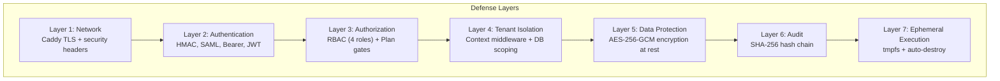
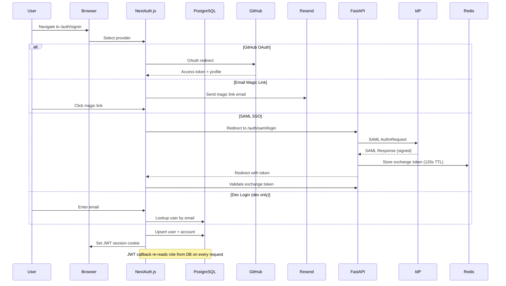
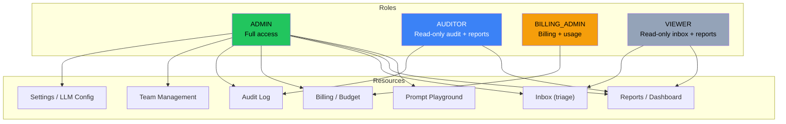
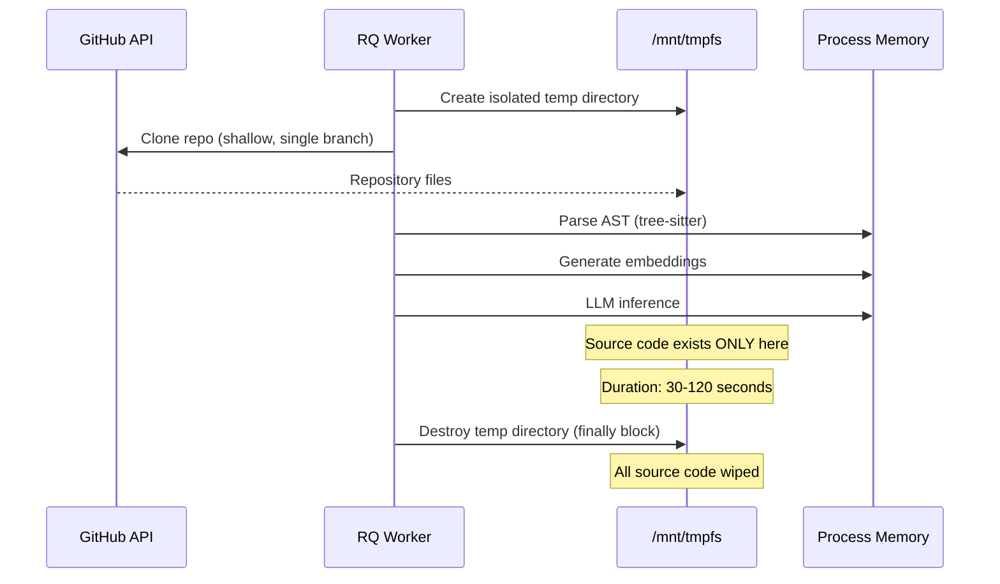
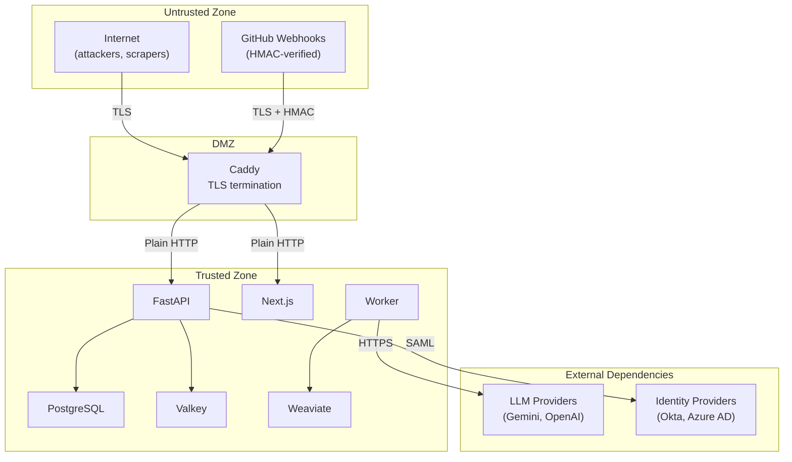

# SAD-04: Security & Compliance Architecture

> **Document ID:** SAD-04 | **Version:** 2.0 | **Date:** 2026-04-22
> **Status:** SEC-AUDIT-01 hardening complete (2026-04-21) | **Classification:** Internal / Due Diligence
> **Changelog v2.0:** Webhook HMAC fail-closed (H4); CORS no-wildcard (M1); SSO oracle+rate-limit (H3); Swagger gate (M2); port binding 127.0.0.1 (H2); SSRF validation layer; CRON_SECRET timingSafeEqual; audit retention schedule; SECURITY.md published (H1); SCIM 2.0 active; SSO JIT + samlDefaultRole + SLO route fix.

---

## 1. Security Architecture Overview

DocuGardener's security architecture is built around three core promises:

1. **Zero Retention** — Client source code is never persisted to disk
2. **Tenant Isolation** — No cross-tenant data access at any layer
3. **Auditability** — Every security-relevant action is cryptographically logged

These promises form the product's primary competitive moat against generic AI coding tools and are the foundation of the enterprise sales narrative.



---

## 2. Authentication Architecture

### 2.1 Authentication Methods by Entry Point

| Entry Point | Auth Method | Tenant Resolution | Token Lifetime |
|-------------|------------|-------------------|----------------|
| GitHub Webhooks | HMAC-SHA256 (X-Hub-Signature-256) — **fail-closed** (503 if secret unset, no DEBUG bypass — SEC-AUDIT-01 H4) | `installationId` → Tenant lookup | Per-request |
| Stripe Webhooks | Stripe-Signature header | `stripeCustomerId` → Tenant lookup | Per-request |
| Dashboard (browser) | NextAuth.js JWT session | JWT `tenantId` claim | Session (configurable idle timeout) |
| VS Code Extension | Bearer API key (`dg_xxx`) | Plugin key → `workflowConfig.pluginApiKey` match | No expiry (key rotation manual) |
| SAML SSO | XML signature + certificate | Query parameter `tenant_id` | Exchange token: 120s TTL (Redis) |
| SCIM Provisioning | Bearer token (SHA-256 hashed) | `scimBearerTokenHash` → Tenant lookup | No expiry (token rotation manual) |
| Inter-service (Python ↔ Next.js) | X-Tenant-ID header | Header value | Per-request |

### 2.2 NextAuth.js Configuration



**Providers configured:**
- `GitHubProvider` — primary production provider
- `EmailProvider` — magic link via Resend (`AUTH-01`)
- `CredentialsProvider("saml-sso")` — SAML exchange token consumer
- `CredentialsProvider("dev-login")` — dev-only, gated by `NODE_ENV !== "production"`

**Session Strategy:** JWT (stateless). The `jwt` callback re-reads the user's `role` from the database on every request, ensuring role changes take effect immediately in server components.

### 2.3 SAML 2.0 SSO (ENT-12)

| Aspect | Implementation |
|--------|---------------|
| SP Entity ID | `{APP_URL}/auth/saml/metadata` |
| ACS URL | `{APP_URL}/auth/saml/callback` |
| Binding | HTTP-POST (ACS), HTTP-Redirect (AuthnRequest) |
| Signature | RSA-SHA256 (requires signed response AND assertion) |
| Replay prevention | Redis-backed assertion ID cache (10 min TTL) |
| Max assertion age | 600 seconds |
| JIT provisioning | Creates user on first SSO login — validated by `tests/integration/test_saml_jit_provisioning.py` (14 tests) |
| Default JIT role | `Tenant.samlDefaultRole` — configurable per tenant (defaults to VIEWER) |
| Role mapping | `samlRoleMapAdmin` — IdP group name → ADMIN role |
| SLO (Single Logout) | `/auth/saml/logout` (route path corrected; previous `/sls` path deprecated — TEST-SSO-02 smoke test) |
| SSO-oracle prevention (SEC-AUDIT-01 H3) | Tenant-lookup endpoint `/api/sso/lookup` returns uniform response regardless of whether the tenant exists or has SSO enabled; per-IP rate limit applied |
| Tested IdP | Okta (SP-initiated, validated 2026-04-20) |

### 2.4 SCIM 2.0 Provisioning (ENT-12)

| Endpoint | Purpose |
|----------|---------|
| `GET /scim/v2/ServiceProviderConfig` | Capability advertisement |
| `GET /scim/v2/Schemas` | Schema discovery |
| `GET/POST /scim/v2/Users` | List + create |
| `GET/PUT/PATCH/DELETE /scim/v2/Users/{id}` | Read, replace, partial update, deactivate |

**Token Security:** Token shown once at generation → SHA-256 hash stored in `Tenant.scimBearerTokenHash`. All comparisons use timing-safe comparison.

**Deprovisioning:** `DELETE` sets `User.scimActive = false`. The NextAuth JWT callback checks `scimActive` and blocks login for deactivated users.

---

## 3. Authorization Architecture

### 3.1 Role-Based Access Control (RBAC)



### 3.2 Three-Layer Enforcement

| Layer | Location | Mechanism | Latency | Authoritative? |
|-------|----------|-----------|---------|----------------|
| **1. Middleware** | `web/middleware.ts` | JWT cookie → role check → route-level redirect | <1ms | No (stale JWT) |
| **2. Server Component** | `getServerSession()` | DB re-read of role on every request | ~5ms | Yes (real-time) |
| **3. UI Filtering** | React components | Conditional rendering based on role | 0ms | No (cosmetic only) |

**Known staleness window:** After an admin changes a user's role, middleware (Layer 1) still enforces the old role until the user signs out and back in. Server components (Layer 2) reflect the new role immediately. This is an accepted trade-off: middleware must be fast (no DB queries).

### 3.3 Plan-Based Feature Gating

| Feature | FREE | PRO | TEAM |
|---------|------|-----|------|
| Core drift detection + inbox | Yes | Yes | Yes |
| BYOK (cloud + Ollama) | Yes | Yes | Yes |
| Auto-fix PR + AI author mode | Yes | Yes | Yes |
| VS Code extension | Yes | Yes | Yes |
| Private repositories | No | Yes | Yes |
| Slack / Jira / Linear | No | Yes | Yes |
| Audit log (90-day) | No | Yes | Yes |
| AUDITOR / BILLING_ADMIN roles | No | Yes | Yes |
| Prompt playground | No | Yes | Yes |
| Nightly rollup | No | Yes | Yes |
| Ignore-rate analytics | No | Yes | Yes |
| Policy-as-Code (DOCPOL-01) | No | Yes | Yes |
| Risk Map (MAP-01) | No | Yes | Yes |
| SSO / SAML 2.0 | No | No | Yes |
| Session management (idle timeout, revocation) | No | No | Yes |
| SCIM 2.0 provisioning | No | No | Yes |
| Evidence Pack (timeline + KPI) | No | No | Yes |
| Environment profile export | No | No | Yes |
| On-premises Helm chart | No | No | Yes |

---

## 4. Data Protection

### 4.1 Encryption at Rest

**Algorithm:** AES-256-GCM (NIST-approved authenticated encryption)

| Parameter | Value |
|-----------|-------|
| Key length | 256 bits (32 bytes, provided as 64-hex-char env var) |
| IV | 12 random bytes (per encryption operation) |
| Auth tag | 16 bytes |
| Storage format | `{iv_hex}:{authTag_hex}:{ciphertext_hex}` |

**Encrypted fields:**
- `Tenant.privateKey` — GitHub App private key
- `Tenant.webhookSecret` — GitHub webhook HMAC secret
- `Tenant.llmConfig.apiKey` — Customer LLM API key
- `workflowConfig.slack.webhookUrl` — Slack webhook URL
- `workflowConfig.jira.apiToken` — Jira API token
- `workflowConfig.linear.apiToken` — Linear API token
- `Tenant.samlIdpCertificate` — IdP signing certificate

**Cross-runtime compatibility:** Both Python (`src/security/crypto.py`) and Node.js (`web/lib/encryption.ts`) implementations produce identical ciphertext format, enabling either plane to read/write encrypted fields.

### 4.2 Encryption Key Management

| Environment | Behavior | Risk |
|-------------|----------|------|
| Production (`APP_ENV=production`) | `ENCRYPTION_KEY` must be set; startup fails if missing | None (fail-fast) |
| Development (`APP_ENV=development`) | Falls back to `SHA256("local-dev-secret-key-12345")` | **Known gap** — see Section 8 |

### 4.3 Zero-Retention Architecture



**Implementation details:**
- `tempfile.TemporaryDirectory(dir='/mnt/tmpfs')` — RAM-backed filesystem
- `tmpfs` size: 512MB (configurable)
- Cleanup in `try/finally` — code is wiped even on unhandled exceptions
- Worker isolation: each job gets its own temp directory (no cross-job file leaks)

**What IS persisted (by design):**
- Job metadata (drift score, severity, entity names) → PostgreSQL
- Document embeddings (content chunks, not source code) → Weaviate
- LLM usage metrics (token counts, cost) → PostgreSQL

**What is NOT persisted:**
- Raw source code files
- Full file contents
- Git history
- Credentials from cloned repositories

---

## 5. Tenant Isolation

### 5.1 Isolation Layers

| Layer | Mechanism | Enforcement |
|-------|-----------|-------------|
| **Network** | TLS encryption in transit | Caddy / Ingress |
| **Authentication** | Per-tenant credentials (HMAC, SAML, Bearer) | Route handlers |
| **Context** | `TenantContextMiddleware` sets `tenant_id_context` ContextVar | Middleware (see gap in Section 8) |
| **SQL** | All queries filter by `tenantId` | Prisma + SQLAlchemy |
| **Vector DB** | Weaviate native multi-tenancy (tenant shard per namespace) | `collection.with_tenant(tenant_id)` |
| **Ephemeral storage** | Per-job isolated `tempfile.TemporaryDirectory` | Python `tempfile` module |
| **Encryption** | Per-tenant encrypted credentials (AES-256-GCM) | Crypto module |

### 5.2 Weaviate Tenant Namespace Isolation

```
Collection: DocuGardenerTenantV1
├── Tenant Shard: tenant_abc123  ← Tenant A's embeddings
├── Tenant Shard: tenant_def456  ← Tenant B's embeddings
└── Tenant Shard: tenant_ghi789  ← Tenant C's embeddings
```

Every vector query is scoped: `collection.with_tenant(namespace)`. There is no cross-tenant query path — Weaviate enforces this at the storage level.

---

## 6. Audit Architecture

### 6.1 SHA-256 Hash Chain

Every audit event is cryptographically linked to the previous event:

```
Event 1: hash = SHA256(JSON(event_1) + "")
Event 2: hash = SHA256(JSON(event_2) + hash_of_event_1)
Event 3: hash = SHA256(JSON(event_3) + hash_of_event_2)
...
```

**Tamper evidence:** Modifying or deleting any event breaks all subsequent hashes. Verification is O(n) — walk the chain and recompute.

### 6.2 Audit Event Catalog

| Event | Trigger | Actor |
|-------|---------|-------|
| `USER_LOGIN` | Successful authentication | User |
| `USER_LOGIN_FAILED` | Failed authentication attempt | System |
| `SETTINGS_CHANGED` | LLM config, integrations, policy changes | Admin |
| `TRIAGE_DECISION` | Accept / Ignore in inbox | User |
| `REPO_TOGGLED` | Enable / disable repository monitoring | Admin |
| `USER_INVITED` | New user invitation (magic link sent) | Admin |
| `USER_ROLE_CHANGED` | Role assignment update | Admin |
| `USER_REMOVED` | User removed from tenant | Admin |
| `SSO_LOGIN` | SAML SSO authentication | User |
| `SSO_CONFIG_CHANGED` | SAML IdP configuration update | Admin |
| `SESSIONS_REVOKED` | Bulk session revocation | Admin |
| `TRIAL_STARTED` | PRO trial initiated | Admin |
| `TRIAL_EXPIRED` | PRO trial period ended | System |
| `SCIM_USER_CREATED` | User provisioned via SCIM | IdP |
| `SCIM_USER_UPDATED` | User attributes updated via SCIM | IdP |
| `SCIM_USER_DEACTIVATED` | User deactivated via SCIM | IdP |
| `SCIM_USER_REACTIVATED` | User reactivated via SCIM | IdP |
| `SCIM_TOKEN_ROTATED` | SCIM bearer token regenerated | Admin |
| `POLICY_VIOLATION_DISMISSED` | Policy violation acknowledged | User |
| `ACCOUNT_LINKED` | Cross-provider account linking (SEC-09) | System |

### 6.3 Audit Log Schema

Each event record contains:
- `tenantId` — scoped to tenant
- `actorId`, `actorEmail`, `actorIp` — attribution
- `event` — event type enum
- `resourceType`, `resourceId` — affected entity
- `metadata` — JSON with event-specific details
- `hash` — SHA-256 chain hash
- `createdAt` — timestamp (indexed with tenantId for query performance)

### 6.4 Evidence Export

- **Formats:** CSV, JSON
- **Filters:** Date range, event type, actor, severity
- **Access:** ADMIN or AUDITOR role, PRO+ plan
- **TEAM-only features:** Drift event timeline visualization, Evidence Coverage KPI

### 6.5 Retention Policy

Automated daily job (`audit-retention.yml` GitHub Action at 02:00 UTC) enforces 90-day retention for PRO, unlimited for TEAM.

---

## 7. Prompt Security (SEC-02)

### 7.1 Guardrails

Custom prompts (`POST /prompts/{key}`) are validated:

| Guard | Rule | Purpose |
|-------|------|---------|
| Length cap | Max 8,000 characters | Prevent token stuffing |
| Forbidden patterns | 14 regex patterns for jailbreak/injection | Block prompt injection |
| Domain scope gate | Must match 2+ of 10 documentation keywords | Prevent off-domain use |

### 7.2 LLM Determinism Controls

| Control | Implementation |
|---------|---------------|
| Model whitelisting | Only benchmarked Tier 1 models accepted |
| Temperature control | Verifier stage forced to Temperature=0 |
| Grace threshold | Confidence <50% → merge block auto-lifted |
| Output validation | Structured response parsing (VerificationResult schema) |

---

## 8. Known Security Gaps & Risk Register

Based on the SA Assessment (2026-03-12). Items are ordered by priority.

### 8.1 Active Risks

| ID | Finding | Severity | Impact | Status | Mitigation |
|----|---------|----------|--------|--------|------------|
| **P0-1** | Secret material (PEM, .db, .rdb) tracked in Git repository | Critical | Supply-chain compromise; zero-retention credibility | **Closed** (remediated pre-launch) | Rotated; purged from history; CI secret scan active |
| **P0-2** | Encryption silently falls back to known static key when `ENCRYPTION_KEY` missing | Critical | All encrypted tenant credentials readable with known key | **Closed** (SEC-06) | Startup guard in `main.py` lifespan; dev fallback remains (scoped to `APP_ENV=development`) |
| **P0-3** | Tenant context middleware logs missing `X-Tenant-ID` but allows request through | High | Tenantless requests can reach protected routes | **Closed** (SEC-AUDIT-01, 2026-04-21) | Strict enforcement shipped — non-public, non-self-auth routes now 400/401 without valid `X-Tenant-ID`; 25 webhook tests updated to sign HMAC |
| **P1-1** | GitHub installation tokens cached with `lru_cache` (no TTL) | Medium | Expired tokens cause intermittent GitHub API failures | Planned (SEC-08) | Replace with TTLCache keyed by installation ID |
| **P2-1** | `allowDangerousEmailAccountLinking: true` in NextAuth | Low | Unintended identity merges across providers | Documented risk | SEC-09 added ACCOUNT_LINKED audit event for visibility |
| **P2-2** | Execution mode taxonomy has unreachable `sovereign` state in exports | Low | Governance exports may misrepresent capabilities | Known | Align taxonomy across specs, DB, UI, exports |

### 8.2 Remediated Items (Phase 6, 2026-03-12)

| ID | Finding | Fix |
|----|---------|-----|
| SEC-05 | Repository hygiene (generated files tracked) | `.gitignore` expanded; CI hygiene check |
| SEC-06 | Encryption startup guard | `RuntimeError` if `ENCRYPTION_KEY` missing in non-dev |
| SEC-07 | Tenant middleware logging | Warning added; strict enforcement pending |
| SEC-09 | Account linking audit | `ACCOUNT_LINKED` event on cross-provider link |
| SEC-10 | Sovereign mode detection | `DEPLOYMENT_MODE=sovereign` env override |
| SEC-11 | CORS hardening | `allowed_origins=[]` default; `validate_production_config()` |
| CI-02 | Web quality gates | ESLint + tsc + vitest + audit in CI |
| CI-03 | Coverage floors | Python 70%, Web 70%/60% branches |
| CI-04 | SCA scanning | pip-audit HIGH + npm audit high |

---

## 9. CORS Policy

| Environment | `allowed_origins` | Methods / Headers | Credentials | Validation |
|-------------|-------------------|-------------------|-------------|------------|
| Development | `["*"]` (fallback when empty list) | Permissive | Allowed | None |
| Production | Must be explicitly set — **wildcard `*` rejected** at startup (SEC-AUDIT-01 M1) | **Explicit** allowlist (M3): `GET, POST, PATCH, DELETE, OPTIONS` + explicit headers incl. `Authorization, Content-Type, X-Tenant-ID` — no `allow_methods=["*"]` / `allow_headers=["*"]` | Allowed | `validate_production_config()` raises on startup if empty or wildcard |

**Production Caddy headers:**
- `Strict-Transport-Security: max-age=63072000; includeSubDomains; preload`
- `X-Content-Type-Options: nosniff`
- `X-Frame-Options: DENY`
- `Referrer-Policy: strict-origin-when-cross-origin`
- `Permissions-Policy: geolocation=(), microphone=(), camera=()`

---

## 9a. SSRF Validation Layer (SEC-NEW)

All user-controlled outbound URLs pass through `web/lib/ssrf.ts` before any `fetch()`:

| Input surface | Validator | Rejects |
|---------------|-----------|---------|
| Slack webhook URL (`workflowConfig.slack.webhookUrl`) | `assertSafeUrl()` | Private IPs (RFC1918, `127.0.0.0/8`, `169.254.0.0/16`, IPv6 loopback/link-local, cloud-metadata `169.254.169.254`); non-HTTPS; DNS-rebinding host names |
| Jira base URL | `assertSafeUrl()` | Same |
| Linear endpoint (custom deployments) | `assertSafeUrl()` | Same |
| Ollama base URL (BYOK local) | `assertSafeUrl({ allowLocalhost: true })` | Same except `localhost`/`127.0.0.1` explicitly allowed for air-gap mode |
| LLM `baseUrl` override | `assertSafeUrl()` | Same |

Validation is applied on both **settings write** (reject malicious config) and **outbound request** (defence in depth — config may have been written before validator was added).

---

## 9b. Scheduled Endpoint Auth (CRON_SECRET)

The `POST /api/admin/audit/retain` endpoint performs SOC 2 audit-log retention (cold-storage archive + hard-delete). It is called by a scheduled GitHub Action (`.github/workflows/audit-retention.yml`, 02:00 UTC daily).

| Control | Implementation |
|---------|---------------|
| Authentication | `Authorization: Bearer ${CRON_SECRET}` |
| Comparison | `crypto.timingSafeEqual()` — prevents timing-oracle attacks |
| Fail-closed | Missing/mismatched secret → 401 (no DEBUG bypass, no fallback) |
| Retention windows | `AUDIT_HOT_DAYS` (default 90) → archive; `AUDIT_DELETE_DAYS` (default 365) → hard-delete |
| Cold storage | S3-compatible object storage (Hetzner Object Storage in prod) |

---

## 9c. Swagger / OpenAPI Docs Gate (SEC-AUDIT-01 M2)

FastAPI `/docs` and `/redoc` are enabled only when `SWAGGER_ENABLED=true`. In production this is unset by default — the endpoints return 404. Rationale: public API surface enumeration is attack recon; dev/staging retain docs for developer productivity.

---

## 10. Threat Model Summary

### 10.1 Trust Boundaries



### 10.2 Key Threats

| Threat | Vector | Mitigation | Residual Risk |
|--------|--------|------------|---------------|
| **Webhook forgery** | Fake GitHub webhook POST | HMAC-SHA256 signature verification | Low (requires webhook secret) |
| **Prompt injection** | Malicious prompt via settings | SEC-02 guardrails: forbidden patterns + domain scope | Medium (14 patterns; novel bypasses possible) |
| **Cross-tenant data access** | Manipulated X-Tenant-ID header | Context middleware **strict enforcement** (SEC-AUDIT-01, 2026-04-21) — 400/401 on missing tenant for non-public routes | Low |
| **Credential theft via repo** | PEM file in Git history | Rotation + history purge complete; CI secret scan active | Low |
| **Token expiry failure** | Stale GitHub installation token | `lru_cache` without TTL (P1-1) | Medium (intermittent API failures) |
| **Account takeover via linking** | Cross-provider email collision | `allowDangerousEmailAccountLinking` (P2-1) | Low (audit event added) |
| **LLM data exfiltration** | Code sent to external LLM API | BYOK + Ollama air-gap option | Accepted risk for SaaS mode |
| **Replay attack on SAML** | Reused SAML assertion | Redis assertion ID cache (10 min TTL) | Low |
| **DoS via webhook flood** | High-volume webhook delivery | Rate limiter: 20/min per installation | Low (burst protection) |

---

## 11. Compliance Posture

### 11.1 GDPR / DSGVO Readiness

| Requirement | Status | Implementation |
|-------------|--------|---------------|
| Data Processing Agreement (DPA) | Template drafted (GTM-06) | `docs/specs/GTM-06*` |
| Privacy Policy | Drafted | Landing page |
| Data minimization | Implemented | Zero-retention architecture; only metadata persisted |
| Right to erasure | Partially implemented | Tenant deletion deletes all Jobs, Users, Repos; Weaviate tenant shard deletion available |
| Audit trail | Implemented | SHA-256 hash chain, 21 event types |
| Encryption at rest | Implemented | AES-256-GCM for all sensitive fields |
| Data residency | Deployment-dependent | Self-hosted Helm chart enables any region |

### 11.2 SOC 2 Readiness

| Trust Principle | Coverage | Notes |
|----------------|----------|-------|
| Security | Partial | Encryption, RBAC, audit log in place; gaps in secret hygiene and tenant enforcement |
| Availability | Partial | Health checks, Docker restart policies; no SLA or uptime monitoring |
| Processing Integrity | Strong | Deterministic AST parsing + LLM verification; audit trail |
| Confidentiality | Strong | Zero-retention, BYOK, encryption at rest, air-gap option |
| Privacy | Partial | GDPR templates drafted; DPA not yet published |

**SOC 2 certification:** Not yet pursued. Prerequisite: resolve P0-1 (secret hygiene) and P0-3 (tenant enforcement).

---

## 12. Security Architecture Decision Log

### SD-01: AES-256-GCM Over RSA for Credential Encryption

**Decision:** Use symmetric encryption (AES-256-GCM) for tenant credentials at rest.

**Rationale:** Credentials are encrypted/decrypted by the same system. RSA would add unnecessary key management complexity for server-side only operations. GCM provides both confidentiality and integrity (authenticated encryption).

### SD-02: JWT Sessions Over Database Sessions

**Decision:** NextAuth.js uses JWT strategy (not database sessions).

**Rationale:** Eliminates DB round-trip per request in middleware. Trade-off: JWT staleness window for role changes (mitigated by Layer 2 DB re-read in server components).

### SD-03: HMAC-SHA256 Over JWT for Webhook Authentication

**Decision:** GitHub webhooks authenticated via HMAC-SHA256 signature, not JWT.

**Rationale:** GitHub sends webhooks with `X-Hub-Signature-256` — this is the platform standard. No alternative exists for GitHub webhook authentication.

### SD-04: Redis-Backed SAML Replay Cache Over Database

**Decision:** SAML assertion IDs cached in Redis with 10-minute TTL.

**Rationale:** Replay prevention requires fast lookup and automatic expiry. Redis TTL is simpler and faster than database cleanup jobs. Assertion IDs are ephemeral — loss on Redis restart is acceptable (worst case: a 10-minute replay window).

### SD-05: Hash Chain Over Append-Only Log for Audit

**Decision:** SHA-256 hash chain linking each audit event to the previous.

**Rationale:** Provides tamper evidence without requiring infrastructure-level immutability (e.g., write-once storage). Any modification or deletion breaks the chain, making tampering detectable by simple forward verification.

---

*Previous: [SAD-03 — Deployment & Operations](SAD-03-Deployment-Operations.md) | Index: [SAD Pack README](README.md)*
